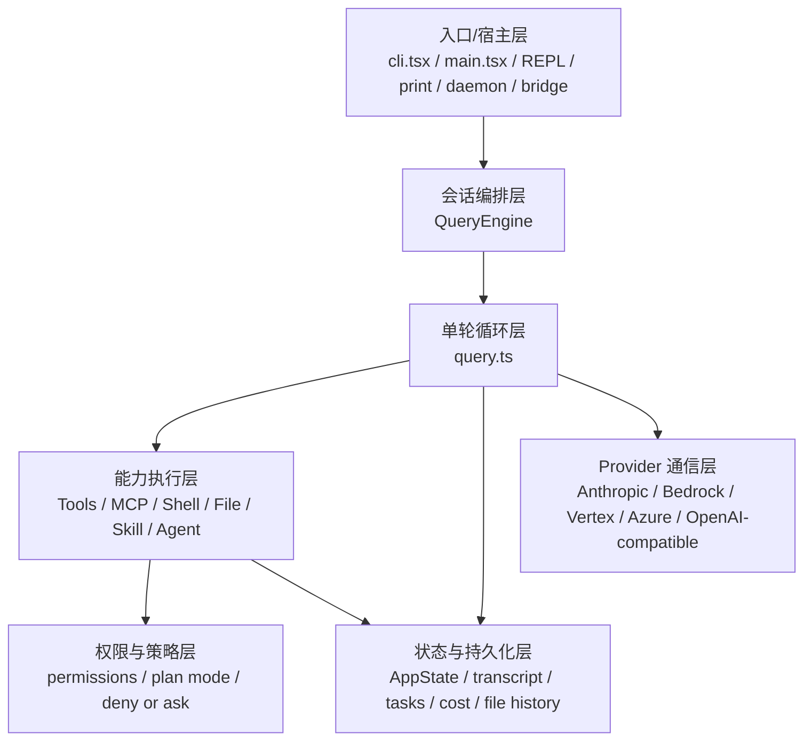
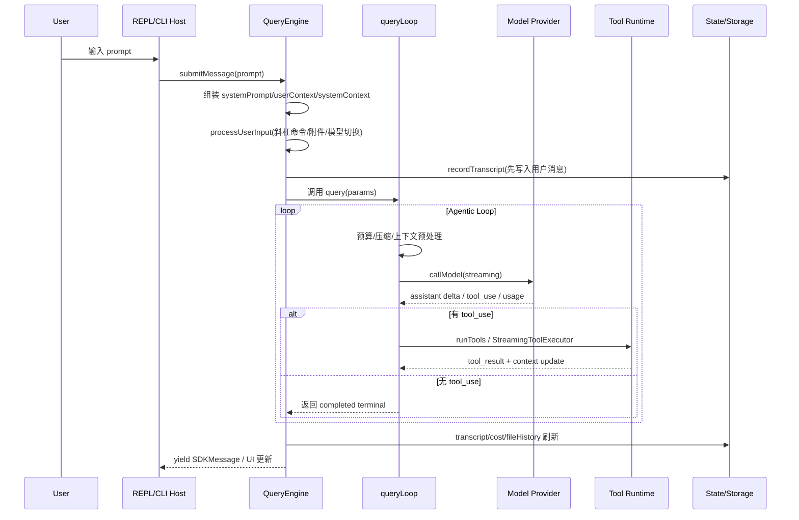
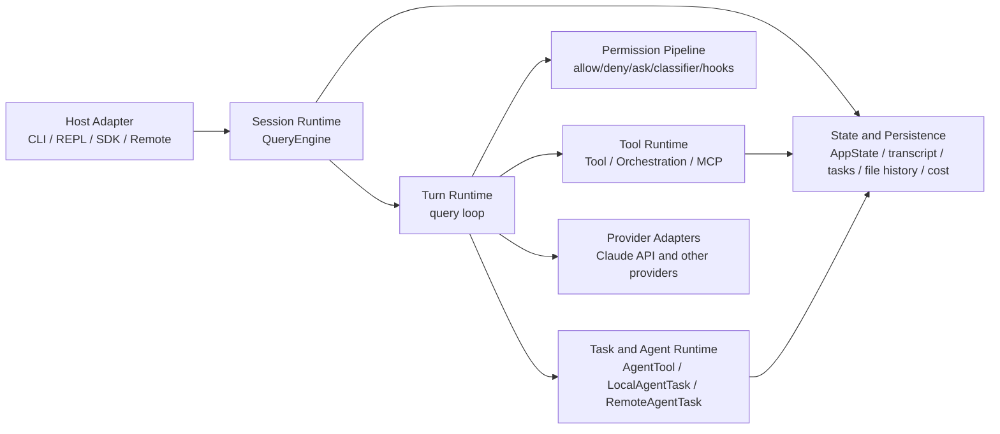

# claude-code-best 整体架构与核心流转分析

## 文档目的

这份文档基于 `/Users/a20250311/github/claude-code-best` 的实际源码与仓库内说明文档，梳理它的：

- 整体后端/运行时架构分层
- 一次用户请求从入口到结束的完整流转
- Tool、Permission、Task、SubAgent 的核心处理逻辑
- State / Transcript / Task 持久化的真相源设计
- 对 `lotus-app` 最值得借鉴的运行时思想

这份文档强调的是**运行时架构**，不是 UI 表象。`claude-code-best` 表面上是 CLI/REPL 应用，但它真正值得对标的是：

- QueryEngine 作为会话编排器
- `query()` 作为单轮 agentic loop
- Tool 作为统一能力抽象
- Permission 作为独立边界
- Task / Agent 作为一等运行时对象
- Store 作为薄状态容器，而不是业务大杂烩

---

## 一句话总览

`claude-code-best` 的本质不是“命令行工具调用大模型”，而是一个**Runtime-first 的 Agent 系统**：

- 入口层负责接入 CLI / REPL / SDK / daemon / remote 模式
- `QueryEngine` 负责“一个 session 内的多轮编排”
- `query()` 负责“一个 turn 内的自主循环”
- Tool 层负责“能力执行与上下文更新”
- Permission 层负责“每次能力调用前的决策与阻断”
- Task / Agent 层负责“后台任务、子代理、团队协作、隔离执行”
- State / Transcript / Task Files 负责“恢复、续跑、审计、回放”

---

## 核心源码地图

### 1. 入口与宿主层

- `src/entrypoints/cli.tsx`：CLI 快速入口、fast-path 分发、daemon/bridge/bg session 等特殊模式入口
- `src/main.tsx`：主启动文件，初始化配置、auth、analytics、policy、plugin、skills、REPL
- `src/screens/REPL.tsx`：交互式终端 UI 宿主
- `src/cli/print.ts`：非交互/headless/SDK 类路径的重要宿主实现

### 2. 查询与会话编排层

- `src/QueryEngine.ts`：多轮会话编排器，一个会话一个实例
- `src/query.ts`：单轮 agentic loop 核心
- `src/query/config.ts`：query 配置快照构建
- `src/query/deps.ts`：query 依赖注入点
- `src/query/tokenBudget.ts`：预算追踪与续接判断

### 3. Tool Runtime 层

- `src/Tool.ts`：Tool 抽象、ToolUseContext、权限上下文、工具接口
- `src/tools.ts`：全量工具注册、启用过滤、tool pool 组装
- `src/services/tools/toolOrchestration.ts`：工具批次调度、串并行执行
- `src/services/tools/toolExecution.ts`：单个 tool_use 的执行细节
- `src/services/tools/StreamingToolExecutor.ts`：流式工具执行优化

### 4. Permission 层

- `src/utils/permissions/permissions.ts`：权限规则解析、匹配、提示与决策入口
- `src/utils/permissions/PermissionMode.ts`：权限模式
- `src/utils/permissions/PermissionResult.ts`：权限决策结果模型
- `src/utils/permissions/permissionsLoader.ts`：规则装载

### 5. Task / Agent Runtime 层

- `src/tools/AgentTool/AgentTool.tsx`：子 Agent 主入口
- `src/tools/AgentTool/runAgent.ts`：子 Agent 真正运行逻辑
- `src/tasks/LocalAgentTask/LocalAgentTask.tsx`：本地 agent 任务
- `src/tasks/RemoteAgentTask/RemoteAgentTask.tsx`：远程 agent 任务
- `src/utils/tasks.ts`：任务持久化、共享任务列表、锁与并发
- `src/utils/task/framework.ts`：任务框架、轮询、通知、任务输出增量

### 6. 状态与存储层

- `src/state/store.ts`：极薄 store 实现
- `src/state/AppStateStore.ts`：AppState 真正的数据模型
- `src/utils/sessionStorage.ts`：对话 transcript 持久化
- `src/cost-tracker.ts`：成本与 usage 累积
- `src/utils/fileHistory.ts`：文件快照/回滚

---

## 分层架构理解

可以把它理解成下面 6 层，而不是单纯的 CLI 程序：

### 第 1 层：入口/宿主层

这一层只负责“从哪里进来”和“怎么展示/接收”。

它支持的不是单一入口，而是一组宿主：

- 交互式 REPL
- headless / print / SDK 风格调用
- daemon worker
- remote-control / bridge
- background session（`ps/logs/attach/kill`）

也就是说，`claude-code-best` 的核心并不绑定在某一个 UI 上。CLI 只是最主要宿主，但**QueryEngine + query + tools** 才是核心。

### 第 2 层：会话编排层（QueryEngine）

`QueryEngine` 的职责是：**维护一个 session 在多个 turn 之间的长期状态**。

它管理的不是只有 messages，还包括：

- `mutableMessages`：完整对话历史
- `readFileState`：已读文件缓存
- `totalUsage`：累计 token 用量
- `permissionDenials`：权限拒绝记录
- `discoveredSkillNames`：本轮发现的技能
- `loadedNestedMemoryPaths`：已加载 memory 路径去重
- `abortController`：会话级中断控制

这说明它是典型的 **Session Runtime / Session Orchestrator**，而不是“某次请求的 helper”。

### 第 3 层：单轮循环层（query.ts）

`query()` / `queryLoop()` 是整个系统最关键的单轮运行时。

它的定位很明确：

- 处理一次用户输入后的完整 agentic turn
- 允许模型连续多轮 tool use
- 在每轮迭代里执行“思考 -> 调 API -> 收 tool_use -> 跑工具 -> 继续/终止”
- 自带恢复逻辑：fallback、context compact、stop hook、token budget、max_output_tokens 恢复

这层相当于 lotus-app 未来应该拥有的 `QueryRuntime` / `TurnLoop`。

### 第 4 层：Tool Runtime 层

Tool 在这里不是零散函数，而是统一能力抽象：

- 所有工具都以 `Tool` 接口暴露
- Tool 有 schema、permission 语义、并发安全语义、progress 语义
- `tools.ts` 负责统一注册和按上下文装配工具池
- `toolOrchestration.ts` 负责按批次执行，区分并行/串行

这就是“Tool 作为能力边界”，不是 chat 主流程里的 if/else。

### 第 5 层：Permission / Policy 层

Permission 被独立出来，而不是散在每个调用点：

- tool 调用前统一判断
- 支持 allow / deny / ask / passthrough
- 规则来源可以来自 session / command / cli arg / managed settings / user/project settings
- 支持 plan mode、sandbox override、working dir、subcommand 级别判断
- 还叠加 classifier / hooks / sandbox / async agent 等高级条件

这一点很关键：它不是“某个 tool 自己决定能不能跑”，而是**系统级 Permission Boundary**。

### 第 6 层：Task / Agent / 持久化层

子 agent、后台任务、队列通知、恢复能力，不是零散补丁，而是通过：

- `AppState.tasks`
- `LocalAgentTask` / `RemoteAgentTask`
- `utils/tasks.ts`
- `utils/task/framework.ts`
- `sessionStorage.ts`

形成统一运行机制。

---

## 一次请求的完整流转

下面是一次普通用户输入进入系统后的主链路。

### 阶段 A：入口初始化

真正的启动并不是直接进入 query。

`src/entrypoints/cli.tsx` 与 `src/main.tsx` 先处理：

- 特殊命令 fast-path：`--version`、daemon、bridge、background session 等
- config / auth / growthbook / analytics / policy / plugin / skill 初始化
- 组装 REPL 或 print/headless 模式

这个设计的意义是：**把模式分发放在宿主层，把核心运行时尽量保持可复用**。

### 阶段 B：QueryEngine.submitMessage()

这一层完成 turn 级准备工作：

1. 清理 turn-scoped 状态，如 `discoveredSkillNames`
2. 解析当前主模型和 thinking 配置
3. 调 `fetchSystemPromptParts()` 动态组装 prompt
4. 包装 `canUseTool`，顺便记录 permission denial
5. 构建 `processUserInputContext`
6. 执行 `processUserInput()`：处理 slash command、附件、meta message、allowedTools 等
7. 把新消息推入 `mutableMessages`
8. 在进入 query loop 之前先 `recordTranscript()`，确保中途崩掉也可 resume
9. 再把请求交给 `query()`

这一层的核心思想是：**query 只关心 turn loop，session 级的准备和持久化由 QueryEngine 负责**。

---

## 单轮核心循环：query.ts 真正在做什么

`queryLoop()` 是系统最关键的状态机。

### 1. 状态对象

它不是靠一堆散变量硬顶，而是用 `State` 在迭代间传递：

- `messages`
- `toolUseContext`
- `autoCompactTracking`
- `maxOutputTokensRecoveryCount`
- `hasAttemptedReactiveCompact`
- `maxOutputTokensOverride`
- `pendingToolUseSummary`
- `stopHookActive`
- `turnCount`
- `transition`

这个设计很像未来 lotus-app 该有的 `TurnState`。

### 2. 预处理管道

每次真正调模型前，会先过完整上下文处理链：

1. `applyToolResultBudget()`：控制工具结果过长
2. `snipCompactIfNeeded()`：历史 snip 压缩
3. `microcompact()`：更细粒度工具结果摘要
4. `applyCollapsesIfNeeded()`：上下文折叠
5. `autocompact()`：超过阈值时自动压缩

这一步很重要，因为它把“上下文管理”变成 query runtime 的内建职责，而不是模型报错之后再补救。

### 3. 流式 API 调用

进入 `deps.callModel()` 后：

- 流式收集 assistant 消息
- 抽取 `tool_use` blocks
- 累积 usage
- 检测 streaming fallback / prompt too long / max_output_tokens 等恢复条件

说明它不是“等模型整段输出完再处理”，而是**边流边驱动状态**。

### 4. 工具执行

如果这一轮模型发出了 tool_use：

- 有 streaming executor 就用 `StreamingToolExecutor`
- 否则走 `runTools()`
- 工具结果标准化为消息，再并回 `messages`
- 更新 `toolUseContext`
- 进入下一轮 `continue`

### 5. 终止条件

结束并不是只有一种 completed：

- 正常完成
- prompt too long 且恢复失败
- API 不可恢复错误
- 流式中断
- tool 阶段中断
- stop hook 阻断
- 超过 maxTurns
- token budget / diminishing returns 终止

这说明 `queryLoop()` 本身就是一个完整运行时状态机，而不是薄包装。

---

## Tool Runtime：工具是如何被组织和执行的

### 工具注册

`src/tools.ts` 是全量工具入口。

它负责：

- 注册 built-in tools
- 按 feature flag / env / mode 决定工具是否启用
- 通过 `filterToolsByDenyRules()` 先做 deny 过滤
- 通过 `assembleToolPool()` 把 built-in tools 和 MCP tools 合并
- 对工具做去重和排序，保证 prompt cache 稳定性

也就是说，系统不是“某个地方直接 new 一个工具”，而是**每次按当前 runtime context 动态装配 tool pool**。

### 工具抽象

`src/Tool.ts` 里定义了非常核心的 `ToolUseContext`，它把工具调用所需运行时能力集中起来：

- 当前 tools / commands / model / mcp clients
- `abortController`
- `getAppState` / `setAppState`
- `readFileState`
- `handleElicitation`
- `setToolJSX`
- notifications / system messages / OS notifications
- nested memory / discovered skills / query tracking
- permission / denial / content replacement 等上下文

这本质上就是 tool runtime 的 capability context。

### 工具调度

`src/services/tools/toolOrchestration.ts` 的核心思想是：

- 先按 `partitionToolCalls()` 把工具调用分组
- 并发安全的读型工具可以批量并行
- 非并发安全工具必须串行
- 每个工具执行时会维护 `inProgressToolUseIDs`
- tool 的 context modifier 可以在工具执行后更新上下文

这比简单的“按顺序跑所有工具”高级很多，因为它已经有明确的**工具调度策略**。

---

## Permission Pipeline：权限不是 UI 细节，而是运行时边界

`src/utils/permissions/permissions.ts` 体现出这个项目一个非常成熟的设计：

- Permission 是系统级基础设施
- Tool 不直接决定自己能不能运行
- UI 只是 Ask 决策的一个呈现端

### 权限规则来源

规则可来自：

- settings 源
- cliArg
- command
- session
- managed / policy 类来源

### 权限决策维度

不仅仅是 allow / deny / ask，还包括：

- `rule`
- `hook`
- `mode`
- `sandboxOverride`
- `workingDir`
- `subcommandResults`
- `permissionPromptTool`
- `classifier`
- `asyncAgent`

也就是说，它不是单层 if/else，而是一个多因素权限判定系统。

### 为什么它重要

因为这让以下事情都能统一收口：

- Plan mode 的只读限制
- Bash/PowerShell 的危险命令审批
- background agent 避免弹权限框
- remote/bridge 环境下的权限代理
- classifier/hook 自动拦截

对 lotus-app 的启发很直接：**权限必须从 chat 主链路里抽出来，形成独立 pipeline**。

---

## QueryEngine 为什么是核心编排器

`QueryEngine` 不只是简单调用 `query()`，它承担了“多轮会话”的核心逻辑：

### 1. 会话级状态真相源

它维护：

- 历史消息
- 文件读取缓存
- 累计 usage
- 权限拒绝历史
- 已发现技能
- 已加载 memory 路径
- session 级 abort

### 2. 持久化前置

在真正发起模型调用前先把用户消息写入 transcript，这个细节很重要：

- 即使 API 还没返回
- 即使中途 stop / crash
- 也能保证 resume 时至少恢复到“用户消息已被接受”的状态

### 3. 模型切换与 prompt 重构

每个 turn 都重新：

- 解析模型
- 重建 system prompt
- 合并 user/system context
- 处理 memory mechanics prompt

所以模型配置、prompt 组装和会话历史是解耦的。

---

## Task Runtime：后台任务是如何被一等化的

`claude-code-best` 里 task 不是某个功能模块私有的数据结构，而是统一运行时对象。

### 任务框架的两层结构

#### 第一层：内存态 / UI 态任务

`src/utils/task/framework.ts` 负责：

- 注册任务到 `AppState.tasks`
- 维护任务状态更新
- 生成 task attachment / notification
- 轮询运行中任务
- 处理 terminal task 的 eviction

这层更偏运行中的会话内状态。

#### 第二层：文件持久化任务列表

`src/utils/tasks.ts` 负责：

- 任务 schema
- `taskListId` 解析
- `~/.claude/tasks/<taskListId>/<id>.json` 文件持久化
- 高水位 ID
- lockfile 并发控制
- reset/list/update/block 等操作

这层更偏跨进程、跨 teammate、跨 session 的共享状态。

### 设计意义

这说明它把任务拆成了：

- 会话内 UI/运行时任务状态
- 会话外共享任务文件系统

这就是为什么 swarm / teammate / background agent 能工作。

---

## SubAgent / AgentTool：不是附属逻辑，而是完整运行时能力

`AgentTool` 是整个系统最像“Agent Runtime”的部分。

### AgentTool 入口做了什么

调用 `Agent()` 时，它会依次处理：

1. 解析 agent 类型或 fork 模式
2. 做 agent 级权限过滤：`filterDeniedAgents()`
3. 检查必需 MCP server 是否可用
4. 为子 agent 组装独立工具池：`assembleToolPool()`
5. 可选创建 worktree 隔离环境
6. 决定同步 / 后台 / 远程路径
7. 调 `runAgent()` 执行真正子循环
8. `finalizeAgentTool()` 汇总结果为 tool_result

### 两种子 agent 模式

#### 1. 命名 Agent

- 有独立 agent definition
- 有独立 permission mode
- 有独立 tools 过滤结果
- 有独立 system prompt
- 适合专业分工

#### 2. Fork 子 Agent

- 继承父对话上下文
- 强调 prompt cache 命中
- 一般继承父模型
- 用统一 placeholder tool_result 构造相同前缀
- 适合并行探索

### 同步/异步/后台化

AgentTool 支持：

- 直接同步执行
- `run_in_background=true` 直接后台
- 前台跑太久后自动背景化
- 异步 agent 独立 AbortController
- 完成后发 notification 给父 session

这意味着 subagent 在这里已经不是 chat 流程里的“特殊工具”，而是**真正的任务/代理执行单元**。

---

## 状态与持久化：它为什么能恢复、能续跑、能协作

### 1. AppState 是运行时内存真相源

`src/state/store.ts` 很薄，只提供：

- `getState`
- `setState`
- `subscribe`

真正重要的是 `AppStateStore.ts` 里的领域状态模型，包含：

- settings
- toolPermissionContext
- tasks
- agentNameRegistry
- mcp / plugins / agentDefinitions
- fileHistory / attribution / notifications / elicitation
- teamContext / inbox / bridge / remote state
- speculation / promptSuggestion / plan verification 等

这是一种非常值得学的模式：

- store 很薄
- 领域模型很清楚
- 业务逻辑不堆在 store 实现里

### 2. transcript 是会话恢复真相源

对话持久化在 `sessionStorage.ts` 中走 JSONL transcript：

- 每个项目一个目录
- 每个 session 一个文件
- 每条事件一行 JSON
- 支持增量追加
- 支持 resume / rewind / sidechain transcript

### 3. 文件历史是修改回滚真相源

`fileHistoryMakeSnapshot()` 在文件修改前做快照，这让：

- 用户能 rewind 到某个消息节点
- agent 修改可以更安全地回退
- 恢复不是只靠 transcript 文本

### 4. tasks 文件是协作真相源

任务文件存在 `~/.claude/tasks/<taskListId>/`：

- 能跨进程共享
- 能跨 teammate 协作
- 用 lockfile 防止竞争写坏
- 让 swarm 模式具备统一任务池

---

## 这个架构最核心的 8 个设计点

### 1. 宿主与核心运行时分离

CLI/REPL 只是宿主，真正核心是 `QueryEngine + query + Tool Runtime + Task Runtime`。

### 2. 单轮与多轮清晰分层

- `QueryEngine` 处理 session
- `query()` 处理 turn

这比把所有逻辑堆在一个 send_message 命令里清晰得多。

### 3. Tool 是统一能力边界

所有可执行能力都走 Tool 抽象，而不是 scattered helpers。

### 4. Permission 是独立管线

权限判断不依赖 UI，不和聊天主流程纠缠。

### 5. SubAgent 是一等能力

`AgentTool` 不是附属 hack，而是完整的 agent runtime 入口。

### 6. Task 是长生命周期对象

后台任务、agent、workflow、协作都能挂到任务体系里。

### 7. 持久化不是“最后顺便写一下”

transcript、task files、file history、cost 都是运行时设计的一部分。

### 8. 以恢复和中断为前提设计

resume、abort、fallback、compact、rewind 都不是补丁，而是系统原生能力。

---

## 对 lotus-app 最值得借鉴的部分

如果从 lotus-app 改造视角看，最值得学的不是“CLI 长什么样”，而是以下架构思想：

### 1. `commands/chat.rs` 不应再是业务核心

对标 `claude-code-best`：

- 宿主入口只做参数接收与 runtime 调度
- 真正业务链路下沉到 `SessionRuntime / QueryEngine / TurnLoop`

### 2. 必须分离 Session Runtime 和 Turn Runtime

对标：

- `QueryEngine.ts` = 会话编排
- `query.ts` = 单轮循环

### 3. Tool 必须统一注册与调度

对标：

- `tools.ts`
- `Tool.ts`
- `toolOrchestration.ts`

### 4. 权限必须独立成管线

对标：

- `utils/permissions/permissions.ts`

### 5. Subagent 必须成为一等 runtime

对标：

- `AgentTool.tsx`
- `runAgent.ts`
- task framework

### 6. 状态要分“运行时内存真相源”和“持久化真相源”

对标：

- `AppStateStore.ts`
- `sessionStorage.ts`
- `utils/tasks.ts`
- `fileHistory.ts`

---

## 一份更适合你改造时参考的总结

如果把 `claude-code-best` 翻译成 lotus-app 可落地的后端目标，可以归纳成一句话：

> 它不是“UI 调 command，command 再顺手调 LLM/tool/storage”，而是“宿主层调 SessionRuntime，SessionRuntime 驱动 QueryLoop，QueryLoop 驱动 Tool/Permission/Task/Agent，持久化层只提供恢复与共享状态能力”。

从这个角度看，`claude-code-best` 的真正核心骨架是：

---

## 参考源码与仓库文档

### 关键源码

- `/Users/a20250311/github/claude-code-best/src/entrypoints/cli.tsx`
- `/Users/a20250311/github/claude-code-best/src/main.tsx`
- `/Users/a20250311/github/claude-code-best/src/QueryEngine.ts`
- `/Users/a20250311/github/claude-code-best/src/query.ts`
- `/Users/a20250311/github/claude-code-best/src/Tool.ts`
- `/Users/a20250311/github/claude-code-best/src/tools.ts`
- `/Users/a20250311/github/claude-code-best/src/services/tools/toolOrchestration.ts`
- `/Users/a20250311/github/claude-code-best/src/utils/permissions/permissions.ts`
- `/Users/a20250311/github/claude-code-best/src/tools/AgentTool/AgentTool.tsx`
- `/Users/a20250311/github/claude-code-best/src/utils/tasks.ts`
- `/Users/a20250311/github/claude-code-best/src/utils/task/framework.ts`
- `/Users/a20250311/github/claude-code-best/src/state/store.ts`
- `/Users/a20250311/github/claude-code-best/src/state/AppStateStore.ts`

### 仓库内说明文档

- `/Users/a20250311/github/claude-code-best/docs/introduction/architecture-overview.mdx`
- `/Users/a20250311/github/claude-code-best/docs/conversation/the-loop.mdx`
- `/Users/a20250311/github/claude-code-best/docs/conversation/multi-turn.mdx`
- `/Users/a20250311/github/claude-code-best/docs/agent/sub-agents.mdx`
- `/Users/a20250311/github/claude-code-best/docs/tools/task-management.mdx`

