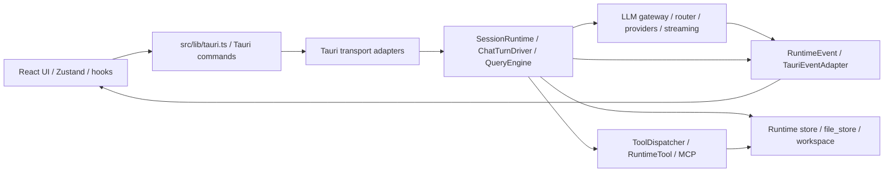

# Architecture Map

## Current Source Of Truth

当前架构判断从这些入口开始：

- `AGENTS.md`: agent 执行约束。
- `CLAUDE.md`: 日常编码、分层、事件协议、工具和发布入口约束。
- `docs/README.md`: 文档导航和归档策略。
- `docs/architecture-blueprint.md`: Runtime-first 架构蓝图。
- `docs/decisions/runtime-decisions.md`: Runtime、网关、成本、managed runtime 等决策。
- `docs/decisions/ui-platform-decisions.md`: UI 和平台兼容决策。
- `docs/decisions/employee-system-decisions.md`: 数字员工和 skill bundle 决策。

## Main System Shape

## Cross-Cutting Boundaries

| Boundary | 说明 | 关键文件 |
|---|---|---|
| Transport boundary | 前端请求进入 Rust Runtime 的入口，同时保持 legacy event 兼容 | `src-tauri/src/transport/tauri_commands/chat.rs`, `src-tauri/src/transport/tauri_event_adapter.rs` |
| Runtime boundary | Session/run/turn/tool/permission 的编排层，不直接承担 UI 展示 | `src-tauri/src/runtime/session_runtime.rs`, `src-tauri/src/runtime/chat/chat_turn_driver.rs`, `src-tauri/src/runtime/query_engine.rs` |
| Tool boundary | catalog 是 schema 真相源，dispatcher 是执行真相源，capability 是新工具能力边界 | `src-tauri/src/runtime/tools/catalog.rs`, `src-tauri/src/runtime/tools/dispatcher.rs`, `src-tauri/src/runtime/tools/capability.rs` |
| LLM boundary | router/provider_merge 决定策略，gateway 执行，provider 输出统一 streaming | `src-tauri/src/llm/router.rs`, `src-tauri/src/llm/gateway.rs`, `src-tauri/src/llm/streaming.rs` |
| Storage boundary | workspace-first 与 path_auth 共同约束文件访问 | `src-tauri/src/storage/workspace.rs`, `src-tauri/src/runtime/path_auth/decide.rs` |
| Event boundary | Runtime 内部发 `RuntimeEvent`，前端兼容事件由 adapter 转换 | `src-tauri/src/runtime/events.rs`, `src-tauri/src/transport/tauri_event_adapter.rs` |

## Downgraded Legacy Areas

- `src-tauri/src/llm/tool_executor/*`: 仍是兼容层，不应作为新工具添加点。
- `src-tauri/src/plugin/registry.rs`: 旧插件和 RuntimeTool 的过渡桥，不是新 runtime 编排核心。
- `docs/archive/**`: 历史背景，不作为当前事实。
