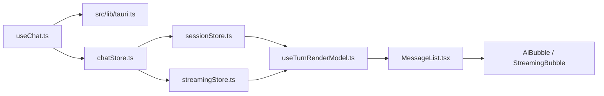

# Frontend Map

## Startup And Event Entry

1. `src/main.tsx` 加载 polyfill、i18n、全局样式并挂载 `App`。
2. `src/App.tsx` 挂载全局 side-effect hooks：streaming、pending、network、drag、updater。
3. `src/lib/tauri.ts` 是 IPC command、legacy event name、payload type 和 listener helper 的唯一真相源。

Tauri contract 增强指出：前端 `src/lib/tauri.ts` 必须同时对齐 Rust `generate_handler!` 注册的 command 名和 runtime legacy event 名。Chat 命令名通过 Rust `commands/chat.rs` wrapper 稳定下来，但 runtime/network/billing 等部分命令直接来自 `transport::tauri_commands::*`；事件侧则同时存在 runtime bus 映射事件和少数 direct emit 事件。回答前端 IPC 影响面时要同时检查 command wrapper、transport adapter、`TAURI_EVENTS` 常量和 listener helper。

App shell / settings / updater / billing / network 链路由 `app-shell-settings-updater-billing` 增强，覆盖 `App.tsx` 启动副作用、`SettingsModal` 面板路由、`settingsStore` 持久化、`billingStore.refresh`、`updaterStore` 检查-缓存-下载-安装状态机、`networkStore` 快照+事件，以及 Rust `settings`、`billing`、`network`、`runtime`、`updater` 命令边界。

Billing/account/network 链路由 `billing-subscription-account-network` 增强：

- `SettingsMenu.tsx` 是设置侧栏入口，`account-billing` 当前按 personal tenant 做前端可见性 gating，`usage` 等入口仍 disabled。
- `GeneralPanel.tsx` 是账户展示/退出登录/外观设置，`AccountBillingPanel.tsx` 才是余额、本月消耗、请求数和流水入口。
- `billingStore.ts` 通过 `src/lib/tauri.ts` 调 `billing_summary` / `billing_usage_records`，前端不直连 billing HTTP API。
- 账号用量页当前由 `AccountBillingPanel.tsx` 承载；工作树未见 checkout、recharge、customer portal 或 invoice 的桌面端闭环。
- `networkStore.ts` 和 `updaterStore.ts` 与 settings 相邻，但分别走 network probe 与 updater command，不属于 billing 主链。

## Chat State And Rendering

重点：

- `chatStore.ts` 是门面，`sessionStore.ts` 和 `streamingStore.ts` 是 slice。
- `streamingStore.ts` 以 per-conversation state 为真相源，旧标量只是兼容派生。
- `useTurnRenderModel.ts` 把落盘消息和 live tool execution 合成 `RenderTurn[]`，避免工具事件早到导致 UI 乱序。
- `AiBubble.tsx` 被 memo 包裹，消息更新必须保持 immutable。

## Streaming Events

`src/hooks/useStreaming.ts` 订阅 streaming/tool/message/agent/task/permission/interaction/turn/file/diagnostics 事件，并写入：

- `chatStore`
- `streamingStore`
- `interactionStore`

这条链路决定用户看到的 waitingLlm、tools、waitingPermission、stalled 等状态。

Prompt/context/cost 增强指出：`turn:completed` 的 token、cache token 和 estimated cost 从 Rust runtime 通过 `src-tauri/src/transport/tauri_event_adapter.rs` 到达 `src/lib/tauri.ts`，再由 `useStreaming.ts` 消费。当前 `TurnCompletedPayload` 和 `streamingStore` 类型已有 cache token 字段，但 `useStreaming.ts` 写 `lastTurnSummary` 时尚未完整落 cache token；回答成本展示或 cache token 影响面时要把这里标成已知缺口。

## Skill Center

技能中心链路：

1. `src/features/skill-center/SkillCenterPage.tsx`
2. `src/stores/skillStore.ts`
3. `src/features/skill-center/uploadWithOverwriteConfirm.ts`
4. `src/features/skill-center/SkillValidationResultDialog.tsx`
5. `src/lib/tauri.ts`

`uploadWithOverwriteConfirm.ts` 负责冲突重试；`SkillValidationResultDialog.tsx` 负责把校验失败转成人可读规则。

## Pending Queue

Pending 队列是事件驱动状态，不是普通 UI 弹窗：

- `src/hooks/usePendingEventListener.ts` 订阅 `pending:*` 事件。
- `src/stores/pendingStore.ts` 处理 snapshot、queued、drained、removed。
- `pendingStore.removeItem` 只发起后端删除意图，本地状态仍应由事件收敛。

## Employee UI

派活链路：

1. `src/features/employees/HireWizard.tsx` 读取 catalog 并创建员工。
2. `src/features/employees/templates.ts` 归一化模板快照和 resource config。
3. `src/features/employees/triggerPrechecks.ts` 判断资源配置和知识源索引状态。
4. `src/features/employees/EmployeeTemplateDetailDialog.tsx` / `EmployeesPage.tsx` 触发派活。
5. `src/features/employees/seedDispatchConversation.ts` 预置会话锚点。
6. `src/stores/chatStore.ts` 和 `src/stores/uiStore.ts` 让聊天页立即可见。

## File And Preview UI

- `src/hooks/useChatAttachments.ts`: 文件选择、粘贴、提交链路。
- `src/hooks/useDragDropListener.ts`: 拖拽文件进入 drop inbox。
- `src/stores/dropInbox.ts`: 临时态附件队列。
- `src/stores/generatedFilePreviewStore.ts`: 当前预览目标。
- `src/components/chat/FilePreviewPane.tsx`: 文件预览面板。

临时态附件和持久化文件必须区分：drop inbox 不是长期可信文件源，upload/generated 文件记录才是持久层。
