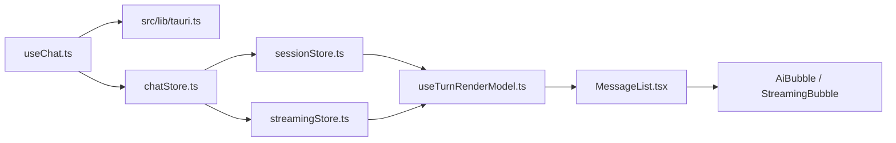

# Frontend Map

## Startup And Event Entry

1. `src/main.tsx` 加载 polyfill、i18n、全局样式并挂载 `App`。
2. `src/App.tsx` 挂载全局 side-effect hooks：streaming、pending、network、drag、updater。
3. `src/lib/tauri.ts` 是 IPC command、legacy event name、payload type 和 listener helper 的唯一真相源。

## Chat State And Rendering

重点：

- `chatStore.ts` 是门面，`sessionStore.ts` 和 `streamingStore.ts` 是 slice。
- `streamingStore.ts` 以 per-conversation state 为真相源，旧标量只是兼容派生。
- `useTurnRenderModel.ts` 把落盘消息和 live tool execution 合成 `RenderTurn[]`，避免工具事件早到导致 UI 乱序。
- `AiBubble.tsx` 被 memo 包裹，消息更新必须保持 immutable。

## Streaming Events

`src/hooks/useStreaming.ts` 订阅 streaming/tool/message/agent/task/permission/interaction/turn/file/diagnostics 事件，并写入：

- `chatStore`
- `streamingStore`
- `interactionStore`

这条链路决定用户看到的 waitingLlm、tools、waitingPermission、stalled 等状态。

## Skill Center

技能中心链路：

1. `src/features/skill-center/SkillCenterPage.tsx`
2. `src/stores/skillStore.ts`
3. `src/features/skill-center/uploadWithOverwriteConfirm.ts`
4. `src/features/skill-center/SkillValidationResultDialog.tsx`
5. `src/lib/tauri.ts`

`uploadWithOverwriteConfirm.ts` 负责冲突重试；`SkillValidationResultDialog.tsx` 负责把校验失败转成人可读规则。

## Pending Queue

Pending 队列是事件驱动状态，不是普通 UI 弹窗：

- `src/hooks/usePendingEventListener.ts` 订阅 `pending:*` 事件。
- `src/stores/pendingStore.ts` 处理 snapshot、queued、drained、removed。
- `pendingStore.removeItem` 只发起后端删除意图，本地状态仍应由事件收敛。

## Employee UI

派活链路：

1. `src/features/employees/HireWizard.tsx` 读取 catalog 并创建员工。
2. `src/features/employees/templates.ts` 归一化模板快照和 resource config。
3. `src/features/employees/triggerPrechecks.ts` 判断资源配置和知识源索引状态。
4. `src/features/employees/EmployeeDrawer.tsx` 触发派活。
5. `src/features/employees/seedDispatchConversation.ts` 预置会话锚点。
6. `src/stores/chatStore.ts` 和 `src/stores/uiStore.ts` 让聊天页立即可见。

## File And Preview UI

- `src/hooks/useChatAttachments.ts`: 文件选择、粘贴、提交链路。
- `src/hooks/useDragDropListener.ts`: 拖拽文件进入 drop inbox。
- `src/stores/dropInbox.ts`: 临时态附件队列。
- `src/stores/generatedFilePreviewStore.ts`: 当前预览目标。
- `src/components/chat/FilePreviewPane.tsx`: 文件预览面板。

临时态附件和持久化文件必须区分：drop inbox 不是长期可信文件源，upload/generated 文件记录才是持久层。
