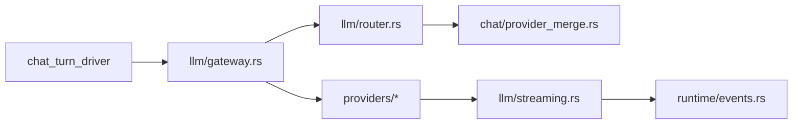

# Runtime Map

## Transport To Runtime

主链路：

1. `src-tauri/src/transport/tauri_commands/chat.rs` 组装 request-scoped services 和 dispatcher。
2. `src-tauri/src/runtime/session_runtime.rs` 创建 session/run/turn 上下文。
3. `src-tauri/src/runtime/chat/chat_turn_driver.rs` 驱动单轮 agentic turn。
4. `src-tauri/src/runtime/chat/tool_round_driver.rs` 处理 LLM tool calls。
5. `src-tauri/src/runtime/query_engine.rs` 构造工具执行上下文和权限上下文。
6. `src-tauri/src/runtime/tools/dispatcher.rs` 统一执行 RuntimeTool。

## Tauri Command And Event Contracts

Tauri command/event 契约由 `tauri-command-event-contracts` 增强：

- `src-tauri/src/lib.rs` 是 setup 和 command 注册主入口，既注册 `commands::*` wrapper，也直接注册部分 `transport::tauri_commands::*`，当前处于 mixed migration 状态。
- Chat 命令是双层结构：`src-tauri/src/commands/chat.rs` 保持前端可见 command 名，内部委托 `src-tauri/src/transport/tauri_commands/chat.rs` 的 `TauriChatCommandAdapter`。
- Runtime 事件先进入 `src-tauri/src/runtime/event_bus.rs`，再由 `src-tauri/src/transport/tauri_event_adapter.rs` 映射成 legacy event，经 `RuntimeHost` / `TauriRuntimeHost` 发到前端。
- `TauriEventAdapter.with_channel_sessions` 会过滤 IM channel session 的 ask/interaction，避免桌面弹窗接到 IM 会话事件。
- 仍有 adapter 外 direct emit：conversation created/title/message updated、skill registry refreshed 等，需要单独检查来源。
- `network:status` 有 Rust 生产端和前端常量，但当前 `src/lib/tauri.ts` 未见标准 `onNetworkStatus` 监听 helper。

## LLM Gateway

规则：

- 模型/任务策略应在 `router.rs` 和 `provider_merge.rs` 收口。
- `gateway.rs` 负责执行路由结果、鉴权失效处理、重试和错误封装。
- provider 只消费执行参数并返回标准 streaming 事件。
- token/cost 统计应在 runtime 层闭环，前端只展示。

## Prompt, Context, Compaction And Cost

Prompt/context/cost 链路由 `prompt-context-compaction-cost` 增强：

1. `src-tauri/src/transport/tauri_commands/chat.rs` 是 Tauri chat 命令和 `RuntimeLlmExecutor` 边界，负责历史装载、LLM step、compact boundary 持久化。
2. `src-tauri/src/runtime/session_runtime.rs` 创建 turn 并按 session 复用或隔离 `QueryEngine`。
3. `src-tauri/src/runtime/chat/chat_turn_driver.rs` 是主执行状态机，串起 prompt snapshot、动态 context、预处理、LLM step、usage 汇总和完成事件。
4. `src-tauri/src/runtime/chat/prompt/sections.rs` 与 `src-tauri/src/llm/prompts.rs` 收口 system prompt 组装；`context_builder.rs` 负责 memory/workspace/file/connector/skill catalog 等动态上下文。
5. `src-tauri/src/runtime/chat/preprocess.rs`、`compaction.rs`、`compact_client.rs` 和 `history.rs` 共同处理 compact 触发、summary 生成、boundary 持久化和 synthetic user context 回放。
6. `src-tauri/src/llm/providers/claude.rs`、`aijia_gateway_v2.rs`、`llm/streaming.rs`、`runtime/query_engine.rs`、`runtime/events.rs` 和 `transport/tauri_event_adapter.rs` 把 provider usage 统一为 session 级 token/cache/cost 统计并发布给前端。

已知缺口：`QueryEngine` 预算阈值的生产注入点尚未确认；cache token 已到 `TurnCompleted`、Tauri adapter、TS payload 和 store 类型，但 `src/hooks/useStreaming.ts` 写 `lastTurnSummary` 时尚未完整落 cache token 字段。

## Tool Runtime

| 组件 | 职责 |
|---|---|
| `runtime/tools/catalog.rs` | 工具定义和 JSON schema 的单一真相源 |
| `runtime/tools/dispatcher.rs` | hook、permission、input validation、execute、failure metric |
| `runtime/tools/permission.rs` | capability、store policy、permission mode、async auto-deny |
| `runtime/tools/capability.rs` | 新工具能看到的窄能力上下文 |
| `runtime/tools/legacy_adapter.rs` | 新旧工具协议转换 |

## MCP Runtime

MCP 链路：

1. `src-tauri/src/runtime/mcp/types.rs` 定义 config、tool definition 和 `mcp__<server>__<tool>` 命名。
2. `src-tauri/src/runtime/mcp/connection.rs` 负责 initialize、tools/list、tools/call。
3. `src-tauri/src/runtime/mcp/manager.rs` 管理 configured/ready/failed/disconnected。
4. `src-tauri/src/runtime/mcp/runtime_tool.rs` 把远端 tool 包成 RuntimeTool。
5. `src-tauri/src/plugin/registry.rs` 动态注册到 dispatcher 和 `TOOL_CATALOG`。

## Managed Runtime Dependencies

构建/运行链路：

1. `package.json` pre hook 调 `scripts/ensure-bundled-runtime.mjs`。
2. `scripts/runtime-sources.json` 固定 Node/Python/uv 源和版本。
3. `scripts/prepare-bundled-runtime.sh` / `.ps1` 产出 resources/runtime。
4. `src-tauri/src/runtime/dependencies/chain_resolver.rs` 串联 resolver。
5. `bundled_resolver.rs`、installed/cache/current pointer 决定可用运行时。
6. `manager.rs` 负责 ensure/install/reinstall/health/diagnostics。
7. `src/components/settings/panels/RuntimePanel.tsx` 展示诊断结果。

## Storage And Path Auth

Workspace-first 文件链路：

1. `src-tauri/src/storage/current_user_storage.rs`
2. `src-tauri/src/storage/workspace.rs`
3. `src-tauri/src/storage/file_manager.rs`
4. `src-tauri/src/storage/file_store/files.rs`
5. `src-tauri/src/runtime/store/authorized_workspace_store.rs`
6. `src-tauri/src/runtime/path_auth/store_bridge.rs`
7. `src-tauri/src/runtime/path_auth/decide.rs`

`path_auth/decide.rs` 是安全边界。文件命令和 workspace 工具都应通过它做访问判断。

## Auth, Billing And Network Boundary

User scope/auth/storage 链路由 `user-scope-auth-storage-boundary` 增强：

1. `src-tauri/src/storage/user_scope.rs` 用 tenant_id + user_id 生成 scope key，作为本地用户隔离边界。
2. `src-tauri/src/lib.rs` 的启动顺序先跑 `data_version` 兼容门禁，再做 cloud auth bootstrap、AuthManager restore、legacy->user scope 迁移和 `CurrentUserStorage.activate_scope`。
3. `src-tauri/src/storage/aijia_home.rs`、`user_scoped_paths.rs` 和 `current_user_storage.rs` 共同定义 `~/.renlijia` 全局目录与 `users/<scope_key>` 目录树。
4. `src-tauri/src/commands/auth.rs` 的 `cloud_login` 负责迁移、scope 激活、workspacePath 回填和 active_account 写入。
5. `src-tauri/src/auth/mod.rs` / `auth/deactivation.rs` 把普通 deactivation 和 revoked/401 撤销分开，并通过 handler 清理 CurrentUserStorage、FileManager、ChannelManager 和 pending 状态。
6. `src-tauri/src/commands/workspace.rs`、`runtime/store/authorized_workspace_store.rs` 和 `runtime/path_auth/*` 共同形成会话授权 + path_auth 决策的双层路径控制。

Billing/account/network 链路由 `billing-subscription-account-network` 增强：

1. `src-tauri/src/transport/tauri_commands/billing.rs` 暴露 `billing_summary` 和 `billing_usage_records`，并转调 `AuthManager`。
2. `src-tauri/src/auth/mod.rs` 负责 session_key 生命周期、刷新和单飞；billing/profile 请求必须先拿有效 session_key。
3. `src-tauri/src/auth/client.rs` 对 `/v1/profile` 和 `/v1/billing/*` 发 Bearer 请求。模型列表等 x-api-key 路径不要和 billing 混为一谈。
4. `src-tauri/src/runtime/network/probe.rs` 是独立网络健康探测子系统，通过 `transport/tauri_commands/network.rs` 暴露状态和 force probe。
5. `src-tauri/src/updater/commands.rs` 是独立 updater 命令链，当前工作树未见 entitlement 模块把 billing 额度与 updater/功能解锁直接绑在一起。

已知边界：本仓库只能证明 personal gating 在前端菜单层；Rust billing command 未见本地 enterprise/personal 二次校验测试，最终服务端行为需要服务端证据。

## Employee Runtime

| 文件 | 职责 |
|---|---|
| `src-tauri/src/runtime/employee/runner.rs` | OnDemand/Cron 派活与调度 |
| `src-tauri/src/runtime/employee/store.rs` | 员工记录、生命周期、cron、模板快照和知识状态 |
| `src-tauri/src/runtime/employee/template_store.rs` | 模板快照、global cache、OPS 拉取和 snapshot-first |
| `src-tauri/src/runtime/employee/dispatch_prompt.rs` | 派活 prompt 拼装 |
| `src-tauri/src/runtime/employee/knowledge.rs` | 知识源切块和 cognitive memory 写入 |
| `src-tauri/src/runtime/employee/inbox.rs` | inbox.jsonl、分页、已读和未读聚合 |
| `src-tauri/src/commands/employees.rs` | 前端命令路由 |

Employee dispatch 增强已补充 `runtime-employee-dispatch`：命令层负责鉴权、读取状态和参数透传；`EmployeeRunDispatcher` 在 chat transport 中创建会话、拼装 prompt、运行 chat request，并把成功/失败写回 inbox；`EmployeeStore` 是员工持久态，`EmployeeActiveRuns` 是运行态。

## Agenda Scheduler

Agenda 链路由 `runtime-agenda-scheduler` 增强：

1. `src-tauri/src/runtime/agenda/runner.rs` 每 tick 重新 resolve 用户 scope，并用当前目录重建 `AgendaStore`。
2. `src-tauri/src/runtime/agenda/store.rs` 负责 create/update/take_due/advance_after_fire/skip/restore/mark_orphaned/list_occurrences 状态机。
3. `src-tauri/src/runtime/agenda/trigger_eval.rs` 统一计算下一次触发时间。
4. `src-tauri/src/runtime/tools/builtin/agenda/*.rs` 是 runtime tool 入口，按 current persona 做 owner 约束。
5. `src-tauri/src/transport/tauri_commands/agenda.rs` 是 Tauri 命令入口，`chat.rs` 实现 `AgendaRunDispatcher`，负责创建会话、写 occurrence、推进 schedule 和写终态。

## Task Tools

Task V2 链路由 `runtime-task-tools` 增强：

- `src-tauri/src/runtime/task/task_models.rs` 定义 `TaskRecord` 和 `TaskStatus`。
- `src-tauri/src/runtime/task/task_v2_store.rs` 用会话目录和 `.highwatermark` 做文件持久化。
- `src-tauri/src/runtime/tools/builtin/task_tools.rs` 直接操作 `FileTaskV2Store` 提供 create/list/update/get/claim。
- `src-tauri/src/runtime/tools/builtin/task_stop.rs` 走 `AsyncAgentTaskStore` 停后台任务。
- `src-tauri/src/runtime/tools/builtin/task_output.rs` 读 transcript，支持 offset 增量输出。

## Team Mode And Subagent

Team mode 链路由 `runtime-team-mode-subagent` 增强：

1. `TeamCreate` 在 `TeamRegistry` 中创建会话级 team，并设置 active team。
2. `SpawnSubagent` 在 team scope 下注册 teammate 的 name、inbox 和 cancellation token。
3. `SendMessage` 通过 name/inbox registry 支持定向和广播。
4. `TeammateStop` / `TeamDelete` 取消 token，清理 inbox/name 映射并更新持久态。
5. `lead_idle.rs` 负责 lead 空闲监控和唤醒路径。

## IM Channel Core

IM core 链路由 `im-channel-core-manager` 增强：

- `src-tauri/src/connector/im/trait_def.rs` 定义 `IMConnector`、`ConnectorContext`、`ReplyContent`。
- `src-tauri/src/connector/im/manager.rs` 统一管理 per-platform state、generation、stream cancel、pending enqueue、hydrate 和 shutdown。
- `src-tauri/src/connector/im/shared/router.rs` 负责 sessions.json 和 router key 到 session_id 的映射。
- `src-tauri/src/connector/im/shared/config_store.rs` 统一读写平台配置和 secret。
- `src-tauri/src/connector/im/shared/ask_coordinator.rs` 处理 IM 侧 permission/user-interaction 回复闭环。
- `src-tauri/src/connector/im/shared/reply_manager.rs` 仍是 Dingtalk AI Card 阶段性中转点，是已知迁移边界。

## Skill Registry And Sync

Skill 管理链路由 `skill-management-registry-sync` 增强：

- `plugin/skill/loader.rs` 扫描 user/global roots，解析 `SKILL.md`，按优先级处理同名覆盖。
- `plugin/skill/registry.rs` 是磁盘 skill 的内存 registry，提供 replace_all、catalog 和 sent-skill 追踪。
- `plugin/skill/global_sync.rs` / `sync_command.rs` 处理 OPS/global skill 同步。
- `commands/skill_management.rs` 和 `commands/skill_draft.rs` 处理安装、导入、冲突和 shadow warning。
- `runtime/tools/builtin/load_skill.rs` 和 `refresh_skills.rs` 提供模型侧 Skill/RefreshSkills 工具，并支持 miss 后节流 refresh。
