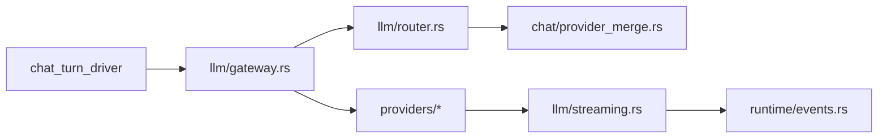

# Runtime Map

## Transport To Runtime

主链路：

1. `src-tauri/src/transport/tauri_commands/chat.rs` 组装 request-scoped services 和 dispatcher。
2. `src-tauri/src/runtime/session_runtime.rs` 创建 session/run/turn 上下文。
3. `src-tauri/src/runtime/chat/chat_turn_driver.rs` 驱动单轮 agentic turn。
4. `src-tauri/src/runtime/chat/tool_round_driver.rs` 处理 LLM tool calls。
5. `src-tauri/src/runtime/query_engine.rs` 构造工具执行上下文和权限上下文。
6. `src-tauri/src/runtime/tools/dispatcher.rs` 统一执行 RuntimeTool。

## LLM Gateway

规则：

- 模型/任务策略应在 `router.rs` 和 `provider_merge.rs` 收口。
- `gateway.rs` 负责执行路由结果、鉴权失效处理、重试和错误封装。
- provider 只消费执行参数并返回标准 streaming 事件。
- token/cost 统计应在 runtime 层闭环，前端只展示。

## Tool Runtime

| 组件 | 职责 |
|---|---|
| `runtime/tools/catalog.rs` | 工具定义和 JSON schema 的单一真相源 |
| `runtime/tools/dispatcher.rs` | hook、permission、input validation、execute、failure metric |
| `runtime/tools/permission.rs` | capability、store policy、permission mode、async auto-deny |
| `runtime/tools/capability.rs` | 新工具能看到的窄能力上下文 |
| `runtime/tools/legacy_adapter.rs` | 新旧工具协议转换 |

## MCP Runtime

MCP 链路：

1. `src-tauri/src/runtime/mcp/types.rs` 定义 config、tool definition 和 `mcp__<server>__<tool>` 命名。
2. `src-tauri/src/runtime/mcp/connection.rs` 负责 initialize、tools/list、tools/call。
3. `src-tauri/src/runtime/mcp/manager.rs` 管理 configured/ready/failed/disconnected。
4. `src-tauri/src/runtime/mcp/runtime_tool.rs` 把远端 tool 包成 RuntimeTool。
5. `src-tauri/src/plugin/registry.rs` 动态注册到 dispatcher 和 `TOOL_CATALOG`。

## Managed Runtime Dependencies

构建/运行链路：

1. `package.json` pre hook 调 `scripts/ensure-bundled-runtime.mjs`。
2. `scripts/runtime-sources.json` 固定 Node/Python/uv 源和版本。
3. `scripts/prepare-bundled-runtime.sh` / `.ps1` 产出 resources/runtime。
4. `src-tauri/src/runtime/dependencies/chain_resolver.rs` 串联 resolver。
5. `bundled_resolver.rs`、installed/cache/current pointer 决定可用运行时。
6. `manager.rs` 负责 ensure/install/reinstall/health/diagnostics。
7. `src/components/settings/panels/RuntimePanel.tsx` 展示诊断结果。

## Storage And Path Auth

Workspace-first 文件链路：

1. `src-tauri/src/storage/current_user_storage.rs`
2. `src-tauri/src/storage/workspace.rs`
3. `src-tauri/src/storage/file_manager.rs`
4. `src-tauri/src/storage/file_store/files.rs`
5. `src-tauri/src/runtime/store/authorized_workspace_store.rs`
6. `src-tauri/src/runtime/path_auth/store_bridge.rs`
7. `src-tauri/src/runtime/path_auth/decide.rs`

`path_auth/decide.rs` 是安全边界。文件命令和 workspace 工具都应通过它做访问判断。

## Employee Runtime

| 文件 | 职责 |
|---|---|
| `src-tauri/src/runtime/employee/runner.rs` | OnDemand/Cron 派活与调度 |
| `src-tauri/src/runtime/employee/store.rs` | 员工记录、生命周期、cron、模板快照和知识状态 |
| `src-tauri/src/runtime/employee/template_store.rs` | 模板快照、global cache、OPS 拉取和 snapshot-first |
| `src-tauri/src/runtime/employee/dispatch_prompt.rs` | 派活 prompt 拼装 |
| `src-tauri/src/runtime/employee/knowledge.rs` | 知识源切块和 cognitive memory 写入 |
| `src-tauri/src/runtime/employee/inbox.rs` | inbox.jsonl、分页、已读和未读聚合 |
| `src-tauri/src/commands/employees.rs` | 前端命令路由 |
