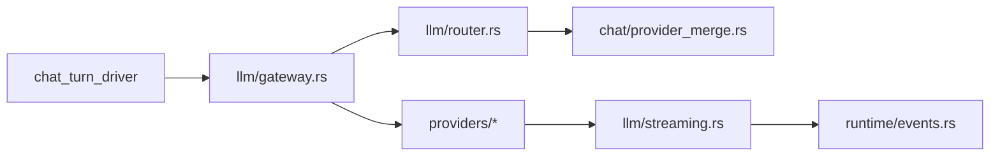

# Runtime Map

## Transport To Runtime

主链路：

1. `src-tauri/src/transport/tauri_commands/chat.rs` 组装 request-scoped services 和 dispatcher。
2. `src-tauri/src/runtime/session_runtime.rs` 创建 session/run/turn 上下文。
3. `src-tauri/src/runtime/chat/chat_turn_driver.rs` 驱动单轮 agentic turn。
4. `src-tauri/src/runtime/chat/tool_round_driver.rs` 处理 LLM tool calls。
5. `src-tauri/src/runtime/query_engine.rs` 构造工具执行上下文和权限上下文。
6. `src-tauri/src/runtime/tools/dispatcher.rs` 统一执行 RuntimeTool。

## Tauri Command And Event Contracts

Tauri command/event 契约由 `tauri-command-event-contracts` 增强：

- `src-tauri/src/lib.rs` 是 setup 和 command 注册主入口，既注册 `commands::*` wrapper，也直接注册部分 `transport::tauri_commands::*`，当前处于 mixed migration 状态。
- Chat 命令是双层结构：`src-tauri/src/commands/chat.rs` 保持前端可见 command 名，内部委托 `src-tauri/src/transport/tauri_commands/chat.rs` 的 `TauriChatCommandAdapter`。
- Runtime 事件先进入 `src-tauri/src/runtime/event_bus.rs`，再由 `src-tauri/src/transport/tauri_event_adapter.rs` 映射成 legacy event，经 `RuntimeHost` / `TauriRuntimeHost` 发到前端。
- `TauriEventAdapter.with_channel_sessions` 会过滤 IM channel session 的 ask/interaction，避免桌面弹窗接到 IM 会话事件。
- 仍有 adapter 外 direct emit：conversation created/title/message updated、skill registry refreshed 等，需要单独检查来源。
- `network:status` 有 Rust 生产端和前端常量，但当前 `src/lib/tauri.ts` 未见标准 `onNetworkStatus` 监听 helper。

## LLM Gateway

规则：

- 模型/任务策略应在 `router.rs` 和 `provider_merge.rs` 收口。
- `gateway.rs` 负责执行路由结果、鉴权失效处理、重试和错误封装。
- provider 只消费执行参数并返回标准 streaming 事件。
- token/cost 统计应在 runtime 层闭环，前端只展示。

### AIjia V2 Visible Reply Language Anchor

AIjia gateway v2 的可见回复语言锚定由 `llm-visible-reply-language-anchor` 增强覆盖，来源为 `origin/main@c4bcc8b7` 的 `src-tauri/src/llm/providers/aijia_gateway_v2.rs` 和 `docs/test-intents/spec/tasks/对话/rules.md`。

- `build_aijia_request_for_route_with_stream` 在 canonical request 组装前读取 `LlmRequest.messages`，从倒序最新真实 `user` message 推断可见回复语言。
- 推断规则会忽略空消息、`[动态上下文...]`、`<system-reminder>`、`# agentsMd`、纯链接和纯代码类 user message；包含 CJK 字符判定为中文，ASCII 字母数达到阈值时判定为英文。
- 推断成功后，provider 会在已有 system segments 末尾追加非 cache 的 `Visible Reply Language` system-reminder；已有 base system segment 的 `ephemeral` cache 语义不变。
- 该锚点只约束用户可见 assistant prose 的语言；代码、路径、命令、API 字段、专有名词和用户要求保留的外语内容不应被翻译。
- 单文件 unit tests 覆盖中文请求经工具调用后仍锚定中文、最新真实 user message 可切到英文，以及用户态 `system-reminder` 不覆盖前一条真实中文请求。
- `意图-对话-031` 到 `034` 提供 E2E 回归验收：命令式首轮输入、后台空输出轮询、英文进度输出和历史英文回访样本都要求 assistant 可见状态说明保持中文，避免 `Still waiting`、`Let me wait`、`No new output` 等英文句泄漏。

边界：本地 `main` 已快进到 `origin/main@c4bcc8b7` 后重放本 wiki 分支；后续若 visible reply language 策略或 intent 规则继续变化，应同步更新 enhancement 与本节。

## Prompt, Context, Compaction And Cost

Prompt/context/cost 链路由 `prompt-context-compaction-cost` 增强：

1. `src-tauri/src/transport/tauri_commands/chat.rs` 是 Tauri chat 命令和 `RuntimeLlmExecutor` 边界，负责历史装载、LLM step、compact boundary 持久化。
2. `src-tauri/src/runtime/session_runtime.rs` 创建 turn 并按 session 复用或隔离 `QueryEngine`。
3. `src-tauri/src/runtime/chat/chat_turn_driver.rs` 是主执行状态机，串起 prompt snapshot、动态 context、预处理、LLM step、usage 汇总和完成事件。
4. `src-tauri/src/runtime/chat/prompt/sections.rs` 与 `src-tauri/src/llm/prompts.rs` 收口 system prompt 组装；`context_builder.rs` 负责 memory/workspace/file/connector/skill catalog 等动态上下文。
5. `src-tauri/src/runtime/chat/preprocess.rs`、`compaction.rs`、`compact_client.rs` 和 `history.rs` 共同处理 compact 触发、summary 生成、boundary 持久化和 synthetic user context 回放。
6. `src-tauri/src/llm/providers/claude.rs`、`aijia_gateway_v2.rs`、`llm/streaming.rs`、`runtime/query_engine.rs`、`runtime/events.rs` 和 `transport/tauri_event_adapter.rs` 把 provider usage 统一为 session 级 token/cache/cost 统计并发布给前端。

已知缺口：`QueryEngine` 预算阈值在普通 chat 主链未见生产注入点；cache token 已到 `TurnCompleted`、Tauri adapter、TS payload 和 store 类型，但 `src/hooks/useStreaming.ts` 写 `lastTurnSummary` 时尚未完整落 cache token 字段。

### Context Budget / Truncation Matrix

长对话“模型忘记前文”排障不要只看模型能力。当前生产路径里，上下文进入 LLM 前会经过多层本地预算和截断。生效性词典：

- 生效：当前普通 chat 生产主路径会读这个值，并会改写、裁剪、降级或限制 LLM 可见上下文。
- 半生效/仅日志：当前普通 chat 主路径会经过这个逻辑，但只做告警、触发尝试或依赖未配置组件，不直接改写上下文。
- 未接入/死字段：当前主 chat 请求链没有读取或调用，不能作为用户反馈的直接原因。
- 测试专用：当前明确证据主要来自测试构造或验证，不能推断生产路径生效。

按生效性分为：

| 层 | 硬编码/规则 | 生效性 | 影响 |
|---|---|---|---|
| 历史回放 | `HistoryConfig::default`: `char_budget=120_000`, `max_rounds=30` | 生效 | `load_history_via_runtime_history` 会使用默认配置，`trim_to_budget` 超限后从最老 round 开始移除。 |
| compact boundary | `tail_message_id` 后回放 + `summary_text` synthetic user context | 有 boundary 时生效 | 本地 `compact_boundaries.jsonl` 存在时，旧 transcript 主要依赖 summary；旧 summary 差会表现为忘前文。 |
| 错误消息 | `error.is_none()` 过滤 | 生效 | UI red callout 会保留，但错误历史不进入下一轮 LLM context。 |
| LLM 前预处理 | `PreprocessConfig::default()` | 生效 | 每轮 LLM step 前执行 tool budget、microcompact、collapse、auto compact 触发判断。 |
| tool 总预算 | `aggregate_char_budget=64_000`, `keep_recent_tool_results=2`, preview `160` chars | 生效 | 工具结果总量过大时，旧工具结果被改写为 `[budget-trimmed]`。 |
| tool collapse | `long_result_chars=8_000`, `keep_recent_tool_results=2`, preview `200` chars | 生效 | 长结果或重复结果被折叠成短 preview。 |
| microcompact | `trigger_chars=120_000`, `keep_recent_tool_results=2` | 生效 | 总上下文过大时，更早的非保留工具结果变成 `[microcompacted]`。 |
| auto compact | `threshold_chars=480_000`, failure limit `3` | 半生效 | 触发逻辑在主路径；默认 `CompactSummaryClient` 未配置时 warn 并返回空 summary，不会产生有效新 boundary。 |
| compact 保尾 | 从最后一个非 summary `user` message 起保留 tail | 生效 | compact 后不是保最近 N 轮，而是保最后一个用户消息起的 tail，其余依赖 summary。 |
| 工具结果默认 | `default_max_result_size_chars=8_000` | 生效 | 大多数工具最终注入 LLM 的 tool message 最多 8k chars。 |
| Read/Glob/Skill | Read `16_000`, Glob `4_000`, Skill `16_000` | 生效 | 工具目录覆盖默认结果预算。 |
| Read 源头 | 默认 `max_bytes=1_048_576`, offset 模式默认 `limit=2000` 行 | 生效 | 文件读取源头先受 1 MiB/2000 行限制，再进入工具结果预算。 |
| Shell 源头 | `MAX_OUTPUT_BYTES=512 * 1024` | 生效 | Bash/PowerShell stdout/stderr 超过 512 KiB 会先被截断。 |
| Grep 源头 | `MAX_RESULTS=1000`, `MAX_FILE_SIZE_BYTES=2 MiB` | 生效 | 搜索结果最多 1000 条，超过 2 MiB 文件会跳过。 |
| Skill catalog | `format_full_catalog(200_000)`, 3% budget, 4 chars/token, desc `80` chars | 生效 | skill catalog 固定按 200k window 估算，不按真实模型上下文窗口动态调整。 |
| AGENTS.md | `MAX_BYTES=65_536` | 生效 | workspace 指令超 64 KiB 会被截断后注入。 |
| Project memory | `MAX_RECALLED_ENTRIES=5` | 生效 | 每次动态上下文只召回 5 条项目记忆。 |
| Cognitive memory | `CONTENT_MAX_LEN=4000`, `CORE_MAX_LINES=200` | 间接生效 | 限制长期记忆单条长度和 core memory 容量。 |
| 图片附件 | 最多 4 张、单张 3 MiB、总计 6 MiB | 生效 | 超限图片降级，不进入当轮多模态上下文。 |
| context window | Claude 200k、DeepSeek 128k、默认 100k，80% warn | 仅日志/半生效 | 主路径只用于 overflow warning，不会裁剪或拦截请求。 |
| `context_decay.apply_decay` | recent 2000 / old 500 | 未接入主 chat | 当前只见定义和测试，不能作为忘前文的直接原因。 |
| `AutoCompactConfig.max_output_chars=80_000` | 字段存在 | 未接入/死字段 | 当前生产代码未读取该字段限制 summary 或输出长度。 |
| QueryEngine budget | `with_max_budget_usd`, `with_cost_per_1k_tokens` | 普通 chat 主链未接入 | 当前主要由测试覆盖；普通 chat 构造链未见生产预算阈值注入。 |

排障顺序：

1. 先检查当前对话是否超过 30 round 或 120000 字符，确认 `history.rs::trim_to_budget` 是否会裁掉早期 round。
2. 再检查用户本地 `<aijia_home>/users/{scope}/conversations/{conversation_id}/compact_boundaries.jsonl` 是否存在旧 boundary；旧版本或旧 summary 质量会影响后续回放。
3. 如果“忘记”的内容来自工具结果、文件读取、搜索或 shell 输出，检查 tool source budget 与 `tool_result_collector` 的二次截断。
4. 如果内容来自 workspace 指令、skill catalog、memory 或图片附件，检查各自动态上下文预算。
5. 不要把 `context_decay.apply_decay`、`max_output_chars` 或 context overflow warn 当成当前主 chat 裁剪来源，除非后续代码接入。

## Tool Runtime

| 组件 | 职责 |
|---|---|
| `runtime/tools/catalog.rs` | 工具定义和 JSON schema 的单一真相源 |
| `runtime/tools/dispatcher.rs` | hook、permission、input validation、execute、failure metric |
| `runtime/tools/permission.rs` | capability、store policy、permission mode、async auto-deny |
| `runtime/tools/capability.rs` | 新工具能看到的窄能力上下文 |
| `runtime/tools/legacy_adapter.rs` | 新旧工具协议转换 |

## MCP Runtime

MCP 链路：

1. `src-tauri/src/runtime/mcp/types.rs` 定义 config、tool definition 和 `mcp__<server>__<tool>` 命名。
2. `src-tauri/src/runtime/mcp/connection.rs` 负责 initialize、tools/list、tools/call。
3. `src-tauri/src/runtime/mcp/manager.rs` 管理 configured/ready/failed/disconnected。
4. `src-tauri/src/runtime/mcp/runtime_tool.rs` 把远端 tool 包成 RuntimeTool。
5. `src-tauri/src/plugin/registry.rs` 动态注册到 dispatcher 和 `TOOL_CATALOG`。

## Managed Runtime Dependencies

构建/运行链路：

1. `package.json` pre hook 调 `scripts/ensure-bundled-runtime.mjs`。
2. `scripts/runtime-sources.json` 固定 Node/Python/uv 源和版本。
3. `scripts/prepare-bundled-runtime.sh` / `.ps1` 产出 resources/runtime。
4. `src-tauri/src/runtime/dependencies/chain_resolver.rs` 串联 resolver。
5. `bundled_resolver.rs`、installed/cache/current pointer 决定可用运行时。
6. `manager.rs` 负责 ensure/install/reinstall/health/diagnostics。
7. `src/components/settings/panels/RuntimePanel.tsx` 展示诊断结果。

## Storage And Path Auth

Workspace-first 文件链路：

1. `src-tauri/src/storage/current_user_storage.rs`
2. `src-tauri/src/storage/workspace.rs`
3. `src-tauri/src/storage/file_manager.rs`
4. `src-tauri/src/storage/file_store/files.rs`
5. `src-tauri/src/runtime/store/authorized_workspace_store.rs`
6. `src-tauri/src/runtime/path_auth/store_bridge.rs`
7. `src-tauri/src/runtime/path_auth/decide.rs`

`path_auth/decide.rs` 是安全边界。文件命令和 workspace 工具都应通过它做访问判断。

## Auth, Billing And Network Boundary

User scope/auth/storage 链路由 `user-scope-auth-storage-boundary` 增强：

1. `src-tauri/src/storage/user_scope.rs` 用 tenant_id + user_id 生成 scope key，作为本地用户隔离边界。
2. `src-tauri/src/lib.rs` 的启动顺序先跑 `data_version` 兼容门禁，再做 cloud auth bootstrap、AuthManager restore、legacy->user scope 迁移和 `CurrentUserStorage.activate_scope`。
3. `src-tauri/src/storage/aijia_home.rs`、`user_scoped_paths.rs` 和 `current_user_storage.rs` 共同定义 `~/.renlijia` 全局目录与 `users/<scope_key>` 目录树。
4. `src-tauri/src/commands/auth.rs` 的 `cloud_login` 负责迁移、scope 激活、workspacePath 回填和 active_account 写入。
5. `src-tauri/src/auth/mod.rs` / `auth/deactivation.rs` 把普通 deactivation 和 revoked/401 撤销分开，并通过 handler 清理 CurrentUserStorage、FileManager、ChannelManager 和 pending 状态。
6. `src-tauri/src/commands/workspace.rs`、`runtime/store/authorized_workspace_store.rs` 和 `runtime/path_auth/*` 共同形成会话授权 + path_auth 决策的双层路径控制。

Billing/account/network 链路由 `billing-subscription-account-network` 增强：

1. `src-tauri/src/transport/tauri_commands/billing.rs` 暴露 `billing_summary` 和 `billing_usage_records`，并转调 `AuthManager`。
2. `src-tauri/src/auth/mod.rs` 负责 session_key 生命周期、刷新和单飞；billing/profile 请求必须先拿有效 session_key。
3. `src-tauri/src/auth/client.rs` 对 `/v1/profile` 和 `/v1/billing/*` 发 Bearer 请求。模型列表等 x-api-key 路径不要和 billing 混为一谈。
4. `src-tauri/src/runtime/network/probe.rs` 是独立网络健康探测子系统，通过 `transport/tauri_commands/network.rs` 暴露状态和 force probe。
5. `src-tauri/src/updater/commands.rs` 是独立 updater 命令链，当前工作树未见 entitlement 模块把 billing 额度与 updater/功能解锁直接绑在一起。

已知边界：本仓库只能证明 personal gating 在前端菜单层；Rust billing command 未见本地 enterprise/personal 二次校验测试，最终服务端行为需要服务端证据。

## Employee Runtime

| 文件 | 职责 |
|---|---|
| `src-tauri/src/runtime/employee/runner.rs` | OnDemand/Cron 派活与调度 |
| `src-tauri/src/runtime/employee/store.rs` | 员工记录、生命周期、cron、模板快照和知识状态 |
| `src-tauri/src/runtime/employee/template_store.rs` | 模板快照、global cache、OPS 拉取和 snapshot-first |
| `src-tauri/src/runtime/employee/dispatch_prompt.rs` | 派活 prompt 拼装 |
| `src-tauri/src/runtime/employee/knowledge.rs` | 知识源切块和 cognitive memory 写入 |
| `src-tauri/src/runtime/employee/inbox.rs` | inbox.jsonl、分页、已读和未读聚合 |
| `src-tauri/src/commands/employees.rs` | 前端命令路由 |

Employee dispatch 增强已补充 `runtime-employee-dispatch`：命令层负责鉴权、读取状态和参数透传；`EmployeeRunDispatcher` 在 chat transport 中创建会话、拼装 prompt、运行 chat request，并把成功/失败写回 inbox；`EmployeeStore` 是员工持久态，`EmployeeActiveRuns` 是运行态。

## Agenda Scheduler

Agenda 链路由 `runtime-agenda-scheduler` 增强：

1. `src-tauri/src/runtime/agenda/runner.rs` 每 tick 重新 resolve 用户 scope，并用当前目录重建 `AgendaStore`。
2. `src-tauri/src/runtime/agenda/store.rs` 负责 create/update/take_due/advance_after_fire/skip/restore/mark_orphaned/list_occurrences 状态机。
3. `src-tauri/src/runtime/agenda/trigger_eval.rs` 统一计算下一次触发时间。
4. `src-tauri/src/runtime/tools/builtin/agenda/*.rs` 是 runtime tool 入口，按 current persona 做 owner 约束。
5. `src-tauri/src/transport/tauri_commands/agenda.rs` 是 Tauri 命令入口，`chat.rs` 实现 `AgendaRunDispatcher`，负责创建会话、写 occurrence、推进 schedule 和写终态。

## Task Tools

Task V2 链路由 `runtime-task-tools` 增强：

- `src-tauri/src/runtime/task/task_models.rs` 定义 `TaskRecord` 和 `TaskStatus`。
- `src-tauri/src/runtime/task/task_v2_store.rs` 用会话目录和 `.highwatermark` 做文件持久化。
- `src-tauri/src/runtime/tools/builtin/task_tools.rs` 直接操作 `FileTaskV2Store` 提供 create/list/update/get/claim。
- `src-tauri/src/runtime/tools/builtin/task_stop.rs` 走 `AsyncAgentTaskStore` 停后台任务。
- `src-tauri/src/runtime/tools/builtin/task_output.rs` 读 transcript，支持 offset 增量输出。

## Agent Foreground Auto Background

Agent/Subagent 前台自动转后台链路由 `runtime-agent-foreground-auto-background` 增强：**默认先以前台方式运行，超过阻塞预算后自动转成 LocalAgent 后台任务继续执行**。

当前源码事实：

1. `src-tauri/src/runtime/tools/builtin/spawn_subagent.rs` 保留 `run_in_background=true` 的显式 async 分支；`false` 或缺省进入 `launch_foreground_auto_background`。
2. `src-tauri/src/llm/tool_executor/spawn_subagent.rs` 在默认前台路径中生成 `AgentId`、transcript path 和独立 cancel token，启动同一个 subagent worker，并 race worker 完成、15 秒默认预算和父 cancellation。
3. 如果 worker 在预算内完成，工具返回普通同步输出；如果预算先到，launcher 调 `register_background_task` 把同一个 worker 登记进 `AsyncAgentTaskStore`，返回 `async_launched`、`task_id`、`task_type=local_agent`、`assistant_auto_backgrounded=true` 和 `auto_background_after_ms`。
4. promotion 后的 worker 完成、失败或 panic 由 `finish_background_subagent` 收尾：写 transcript、更新 `AsyncTaskState`，并通过 `TaskNotificationQueue` 给父 session 注入 `<task-notification>`。
5. `src-tauri/src/runtime/tools/builtin/task_output.rs` 按 task id 读取 LocalAgent transcript；`src-tauri/src/runtime/tools/builtin/task_stop.rs` 校验 task type 后用 `CancellationReason::BackgroundStop` 取消仍在运行的 promoted LocalAgent。
6. `src-tauri/tests/spawn_subagent_auto_background_test.rs` 覆盖短任务同步完成、长任务超预算 promotion、TaskOutput 读取最终输出、完成通知注入、TaskStop 取消和 promotion 前父取消不遗留后台任务；`spawn_subagent_async_test.rs` 锁定显式后台与默认 foreground auto path 的路由边界。

边界：Claude code best 的 foreground Agent task/background signal 只作为历史对标参考。当前 RepoWiki 的事实以 AIjia `SpawnSubagent`/`DefaultSpawnSubagentLauncher` 和对应 Rust 测试为准。

## Shell Auto Background

Shell 前台自动转后台链路由 `runtime-shell-auto-background` 增强：

1. `src-tauri/src/runtime/tools/builtin/bash.rs` 和 `src-tauri/src/runtime/tools/builtin/powershell.rs` 在前台命令执行时都有 10 秒自动后台化预算；只有命令 timeout 更长、后台依赖存在且当前工具上下文有 `conv_dir` 时才启用。
2. 自动后台化不是重启命令，而是把同一个前台 child、stream reader、剩余 timeout 和已捕获输出快照交给 `src-tauri/src/runtime/tools/builtin/shell_task.rs` 继续后台收尾。
3. `src-tauri/src/runtime/tools/builtin/shell_common.rs` 提供可选 transcript 桥接：前台阶段先捕获输出，后台化时 flush 已捕获字节，并记录 `pre_background_flushed_bytes` 避免输出丢失或重复。
4. 显式 `run_in_background=true` 与自动后台化后续都注册为 `AsyncTaskType::LocalBash`，依赖 `src-tauri/src/runtime/agent/async_task_store.rs` 保存 task id、取消 token、状态和 task type；自动后台化返回数据会带 `assistant_auto_backgrounded=true`。
5. 后台化后的可见性分两条链：`TaskOutput` 从 `conv_dir/tasks/{task_id}.jsonl` 等 transcript 候选路径按 offset 读取输出；`TaskNotificationQueue` 在后台任务终态时把 `<task-notification>` 注入后续 chat turn。
6. `TaskStop` 只负责按 task id 找后台 handle 并用 `CancellationReason::BackgroundStop` 取消运行中任务；它不参与自动后台化触发决策。
7. 边界：`SpawnSubagent`/Agent 路径现在也有默认前台超预算自动后台化，但登记的是 `task_type=local_agent`；Shell 自动后台化登记 `task_type=local_bash`，两者共享 `AsyncAgentTaskStore` / `TaskOutput` / `TaskStop` / `TaskNotificationQueue` 这类控制面，不共享 OS child/reader handoff 细节。

已知缺口：Bash 模块内有 foreground -> background 行为测试和 transcript 去重测试；PowerShell 当前主要有阈值 override、前台取消等边界覆盖，尚未达到 Bash 同等强度的行为级回归。

## Team Mode And Subagent

Team mode 链路由 `runtime-team-mode-subagent` 增强：

1. `TeamCreate` 在 `TeamRegistry` 中创建会话级 team，并设置 active team。
2. `SpawnSubagent` 在 team scope 下注册 teammate 的 name、inbox 和 cancellation token。
3. `SendMessage` 通过 name/inbox registry 支持定向和广播。
4. `TeammateStop` / `TeamDelete` 取消 token，清理 inbox/name 映射并更新持久态。
5. `lead_idle.rs` 负责 lead 空闲监控和唤醒路径。

## IM Channel Core

IM core 链路由 `im-channel-core-manager` 增强：

- `src-tauri/src/connector/im/trait_def.rs` 定义 `IMConnector`、`ConnectorContext`、`ReplyContent`。
- `src-tauri/src/connector/im/manager.rs` 统一管理 per-platform state、generation、stream cancel、pending enqueue、hydrate 和 shutdown。
- `src-tauri/src/connector/im/shared/router.rs` 负责 sessions.json 和 router key 到 session_id 的映射。
- `src-tauri/src/connector/im/shared/config_store.rs` 统一读写平台配置和 secret。
- `src-tauri/src/connector/im/shared/ask_coordinator.rs` 处理 IM 侧 permission/user-interaction 回复闭环。
- `src-tauri/src/connector/im/shared/reply_manager.rs` 仍是 Dingtalk AI Card 阶段性中转点，是已知迁移边界。

## Skill Registry And Sync

Skill 管理链路由 `skill-management-registry-sync` 增强：

- `plugin/skill/loader.rs` 扫描 user/global roots，解析 `SKILL.md`，按优先级处理同名覆盖。
- `plugin/skill/registry.rs` 是磁盘 skill 的内存 registry，提供 replace_all、catalog 和 sent-skill 追踪。
- `plugin/skill/global_sync.rs` / `sync_command.rs` 处理 OPS/global skill 同步。
- `commands/skill_management.rs` 和 `commands/skill_draft.rs` 处理安装、导入、冲突和 shadow warning。
- `runtime/tools/builtin/load_skill.rs` 和 `refresh_skills.rs` 提供模型侧 Skill/RefreshSkills 工具，并支持 miss 后节流 refresh。
