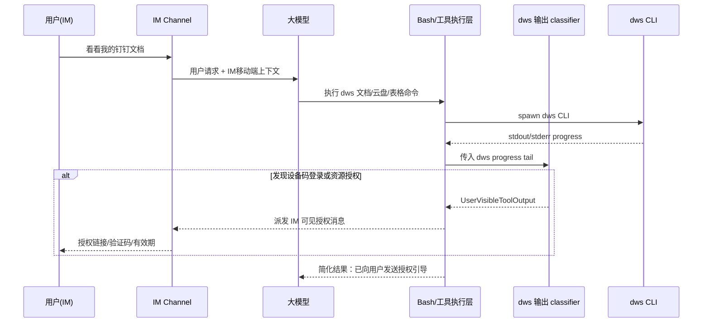

# DWS IM 可见授权输出设计

**日期**：2026-06-02  
**范围**：dws 命令在 IM 渠道中触发登录授权或资源权限授权时，及时把用户必须看到的授权信息发到 IM。  
**非范围**：Agent 长任务可观测性、TaskOutput UI 化、完整 BackgroundRun 系统。

---

## 1. 背景

IM 渠道中，用户只能看到手机或 IM 客户端里的回复，看不到本机浏览器窗口，也看不到桌面 App 内工具卡片的实时 stdout。当前 dws 设备码登录会在命令运行过程中输出授权链接和验证码，桌面 App 通过 `tool:progress` 能看到，但 IM 用户不会稳定收到。大模型通常要等工具调用结束后才能看到完整 tool result，因此会出现“说正在启动设备码登录，但没有把链接发给 IM 用户”的体验断层。

OpenClaw 的参考结论是：授权和权限这类“需要用户操作”的状态不应完全交给提示词。钉钉 connector 直接用结构化 device auth 流程展示 URL/二维码并轮询状态；企业微信插件用 MCP interceptor 拦截文档授权错误并发送授权卡片。它们的共性是：模型负责业务意图，插件或 runtime 负责把确定性的用户操作信息送到渠道。

本设计只解决 dws 在 IM 中的授权输出可见性，不扩展到通用 Agent 执行过程展示。

---

## 2. 目标

1. 当 AI 在 IM 会话中执行 dws 命令，且 dws 输出设备码登录链接、验证码或资源权限授权链接时，IM 用户能及时看到这些信息。
2. IM channel 不直接依赖 dws，不写 dws 专属解析规则。
3. dws 专属识别逻辑集中在 dws adapter 或等价的工具输出 classifier 中。
4. LLM 仍能收到简化的工具状态，知道授权引导已发送，不再反复尝试打开本机浏览器或重复执行登录命令。
5. 第一阶段复用现有 `tool:progress` / `ToolProgressSink` / Bash dws 权限解析基础，不建设完整 BackgroundRun。

---

## 3. 非目标

- 不做 Agent 主流程实时直播。
- 不把 `TaskOutput` 暴露成 IM 用户可见输出。
- 不改 dws CLI 本身的协议。
- 不要求 IM channel 理解 dws 的命令、错误码或业务含义。
- 不实现授权完成后的自动续跑。第一阶段可提示用户完成授权后重试；是否自动续跑后续单独设计。
- 不把所有 stdout/stderr 转发给 IM 用户，只转发明确标记为用户必须看到的授权输出。

---

## 4. 当前代码基础

现有基础已经有一部分可复用能力：

- `RuntimeEventKind::ToolProgress` 已定义工具运行中的 stdout/stderr tail，前端用于展示运行中工具输出。
- `BashTool` 已通过 `ToolProgressSink` 发送长命令实时进度。
- `BashTool` 已有 `command_mentions_dws()` 和 `parse_dws_pat_permission_ask()`，可识别 `PAT_HIGH_RISK_NO_PERMISSION` 资源权限授权请求，并转成 `ToolError::AskRequired`。
- IM 侧已有 permission / user interaction 的协调器，但当前没有一个面向 IM 的“工具进度中用户可见输出”桥。

这说明第一阶段不需要重建运行系统，而是把“工具进度中出现的 dws 用户动作”提升成 IM 可见事件。

---

## 5. 核心设计

新增一个窄接口：`UserVisibleToolOutput`。

```rust
pub struct UserVisibleToolOutput {
    pub conversation_id: String,
    pub run_id: String,
    pub tool_call_id: String,
    pub tool_name: String,
    pub provider: UserVisibleOutputProvider,
    pub kind: UserVisibleOutputKind,
    pub title: String,
    pub message: String,
    pub url: Option<String>,
    pub code: Option<String>,
    pub expires_at_ms: Option<i64>,
    pub dedupe_key: String,
}

pub enum UserVisibleOutputProvider {
    Dws,
}

pub enum UserVisibleOutputKind {
    AuthLogin,
    ResourceAccess,
}
```

这个接口不是完整后台任务模型，只表示“某个正在运行的工具产生了一条应当给当前 IM 用户看的输出”。

数据流：



---

## 6. dws 输出识别

dws adapter 只处理 AI 在工具层发起的 dws 命令。判断入口沿用 `command_mentions_dws()`，命令不是 dws 时不进入解析。

第一阶段识别两类输出。

### 6.1 设备码登录

匹配信号：

- URL 包含 `login.dingtalk.com/oauth2/device/verify`
- 输出中包含 `user_code`、`user code`、`授权码`、`验证码` 等字段之一
- 可选提取有效期，如 `expires_in`、`900 秒`、`15 分钟`

输出：

```rust
UserVisibleToolOutput {
    provider: Dws,
    kind: AuthLogin,
    title: "需要登录钉钉",
    message: "请在手机或浏览器打开授权链接，并输入验证码完成登录。",
    url: Some("https://login.dingtalk.com/oauth2/device/verify.htm?..."),
    code: Some("GXQQ-MGZQ"),
    expires_at_ms: Some(now + 900_000),
    dedupe_key: "dws-auth-login:<tool_call_id>:<url-or-code>",
}
```

### 6.2 资源权限授权

匹配信号：

- 现有 `parse_dws_pat_permission_ask()` 解析到 `PAT_HIGH_RISK_NO_PERMISSION`
- 输出包含 `authorizationUrl` / `authorization_url` / `authUrl` / `url` / `uri`
- 可选包含 `flowId`、`requiredScopes`

输出：

```rust
UserVisibleToolOutput {
    provider: Dws,
    kind: ResourceAccess,
    title: "需要授权访问钉钉资源",
    message: "请打开授权链接完成权限授权，授权后再继续当前操作。",
    url: Some(authorization_url),
    code: None,
    expires_at_ms: None,
    dedupe_key: "dws-resource-access:<flow_id-or-url>",
}
```

---

## 7. IM 派发规则

IM channel 只消费 `UserVisibleToolOutput`，不解析 dws 输出。

派发文案模板：

设备码登录：

```text
需要先登录钉钉才能继续。

请打开授权链接：
{url}

验证码：{code}
{expires_text}
```

资源权限授权：

```text
需要先授权访问钉钉资源才能继续。

请打开授权链接：
{url}
```

派发要求：

- 同一 `dedupe_key` 在同一 turn 内只发送一次。
- URL 必须以纯文本形式出现，确保移动端可点击。
- 如果 code 存在，必须单独一行展示。
- 不发送完整 stdout/stderr。
- 失败时不阻塞原工具执行，但要记录日志，便于排查 IM 未投递。

---

## 8. LLM 可见结果

当 classifier 产生 `UserVisibleToolOutput` 后，工具结果或后续动态上下文应让 LLM 明确知道：

```text
已向 IM 用户发送钉钉授权链接。用户完成授权前，不要重复启动登录流程，也不要声称本机浏览器打开即可完成。请提示用户完成授权后重试或等待。
```

第一阶段不要求自动暂停/恢复工具调用。若 dws 命令仍在 polling 并最终超时，LLM 最终会拿到超时结果，但 IM 用户已经提前看到链接。

---

## 9. 过期与重试

第一阶段只做轻量过期展示，不做持久化状态机。

- 如果能提取 `expires_at_ms`，IM 文案展示“约 15 分钟内有效”。
- 不实现后台定时发送“已过期”消息。
- dws polling 超时后，LLM 可回复“授权已超时，请重新发起”。
- 下一次用户请求重新触发 dws 命令时，可生成新的 `UserVisibleToolOutput`。

后续若要做自动过期提醒，再升级为 pending action 或 BackgroundRun，不在本 spec 范围。

---

## 10. 安全与隐私

- 只允许转发明确识别出的 URL、验证码、简短标题和简短说明。
- 不转发 dws stdout/stderr 全文。
- 不转发 client secret、token、cookie、env、文件路径等敏感信息。
- URL 只允许 `https://`。
- 设备登录 URL 第一阶段限制为 `login.dingtalk.com`。
- 资源权限 URL 由 dws 结构化错误提供，若 host 不可信则不转发，只给 LLM 普通错误。
- 所有解析失败的输出按普通工具输出处理，不猜测。

---

## 11. 测试口径

Rust 单元测试：

- dws 设备码输出能解析出 URL、code、expires。
- dws 设备码输出缺少 URL 时不产生 IM 可见输出。
- `PAT_HIGH_RISK_NO_PERMISSION` 继续能解析资源权限链接。
- 非 dws 命令即使包含类似 URL 也不产生输出。
- 同一 `dedupe_key` 在同一 turn 内只派发一次。
- 解析器不会把 token、secret、env 样式字段放进 message。

集成测试：

- 模拟 IM 会话执行 dws 设备码登录输出，确认 IM dispatcher 收到 `UserVisibleToolOutput`。
- 模拟 dws resource access 错误，确认 IM dispatcher 收到资源授权消息。
- 桌面 App 的 `tool:progress` 展示不回归。
- 现有 `plan_u3_context_pipeline_test` 和 IM pending queue 测试不回归。

手工验证：

1. 退出 dws 登录。
2. 从钉钉 IM 发送“看看我的钉钉文档最新文件”。
3. 确认手机端收到授权链接和验证码。
4. 确认 App 内仍能看到工具运行状态。
5. 完成授权后再次发送请求，确认 dws 文档查询能成功。

---

## 12. 分阶段落地

### Phase 1：dws IM 可见输出桥

- 新增 dws 输出 classifier。
- 从 Bash dws progress/final output 调用 classifier。
- 新增 user-visible output 派发接口。
- IM channel 订阅并发送消息。
- 测试设备码登录和资源权限授权。

### Phase 2：结构化事件优先

如果 dws CLI 后续支持 json events，classifier 优先解析结构化事件，stdout 正则只作为兼容路径。

### Phase 3：再考虑通用 run 可观测性

Agent 长任务、TaskOutput、BackgroundRun 另立 spec，不与本设计混合。

---

## 13. 成功标准

- IM 钉钉场景下，dws 未登录时用户能在手机端及时收到授权 URL 和验证码。
- 资源权限授权请求能通过同一桥接机制发到 IM。
- IM channel 代码不包含 dws 专属解析。
- dws 专属逻辑集中在 adapter/classifier。
- 不引入完整后台任务系统。
- 不把 Agent/TaskOutput 纳入本次实现范围。
