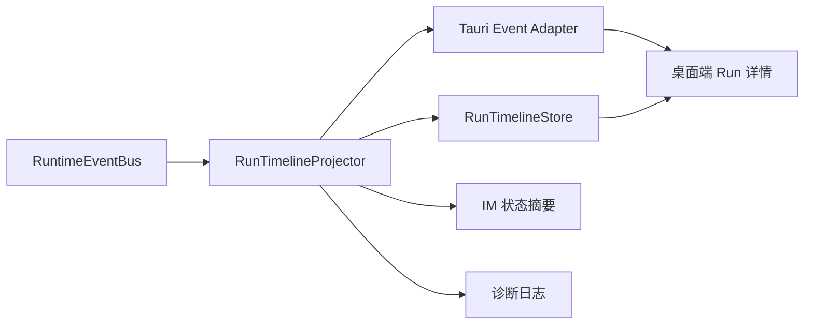
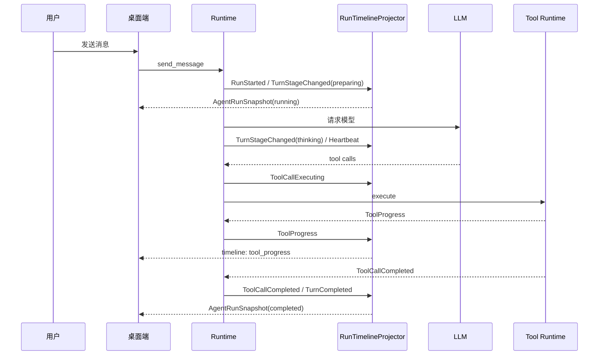
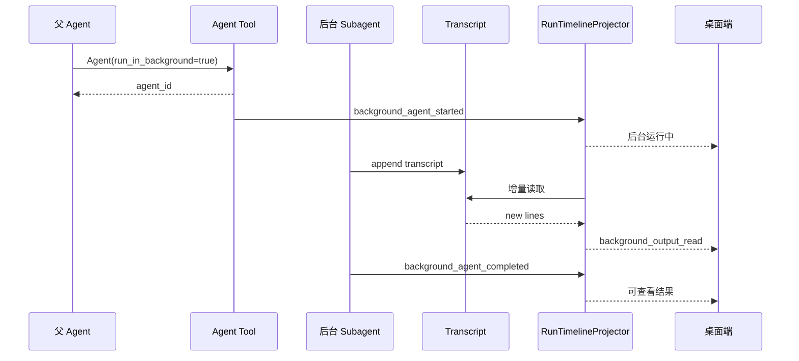

# Agent Run 可观测性设计

**日期**：2026-06-03  
**范围**：Agent 执行时间较长时，桌面端和 IM 端如何展示“还活着、正在做什么、是否需要用户动作、点开后能看到哪些执行状态”。  
**非范围**：DWS 授权输出桥、具体工具私有解析、完整链路监控平台、模型隐藏推理展示。

---

## 1. 背景

当前用户在等待 Agent 执行时，经常只能看到“思考中”或工具卡片转圈。长任务一旦超过几十秒，用户很容易误判为卡死。这个问题和 dws CLI 授权输出相似：真正的问题不是模型不会思考，而是运行时已经有过程信息，却没有被整理成用户可见、渠道可用、可点击查看的状态。

现有系统已经有不少基础：

- `RuntimeEventKind::TurnStageChanged` 表达主 turn 宏观阶段。
- `RuntimeEventKind::TurnHeartbeat` 用来区分“静默但活着”和“卡住”。
- `RuntimeEventKind::ToolCallExecuting` / `ToolProgress` / `ToolCallCompleted` 表达工具执行过程。
- 前端 `useStreaming.ts` 已把 `ToolProgress` 写入工具步骤的 `progressTail`。
- `Agent(run_in_background=true)` 已能返回 `agent_id`，后台 subagent transcript 可由 `TaskOutput(task_id, offset)` 增量读取。

这些能力现在分散在工具卡、turn 状态、subagent transcript 和 task notification 中。目标不是把它们全部原样展示给用户，而是新增一层通用的“运行时间线投影”，把内部事件转换成可读、可点击、可过滤的过程状态。

外部参考也支持这个方向：

- OpenAI Background Mode 把长任务建模为可轮询的后台 response，状态可处于 `queued` / `in_progress` / 终态，而不是让调用方一直阻塞等待：https://developers.openai.com/api/docs/guides/background
- OpenAI Responses Streaming 为输出项和工具过程提供带 `sequence_number` 的事件流，便于客户端按序更新 UI：https://platform.openai.com/docs/api-reference/responses-streaming/response?lang=node
- Claude Code Agent SDK 强调实时流式响应、审批和用户输入；hooks 暴露 `PreToolUse` / `PostToolUse` / `SubagentStart` / `SubagentStop` 等生命周期事件，并带 transcript 路径等调试字段：https://code.claude.com/docs/en/agent-sdk/overview 和 https://code.claude.com/docs/zh-TW/hooks
- LangGraph 提供 `updates` / `values` / `messages` / `custom` 等 stream modes，区分状态更新、模型消息和自定义进度：https://docs.langchain.com/oss/python/langgraph/streaming

共同点是：长任务不是黑盒；用户看到简洁状态，开发者和高级用户可以展开细节，但不展示模型隐藏推理。

---

## 2. 目标

1. Agent 执行超过短时间阈值后，用户能持续看到“仍在运行”和当前阶段，避免误解为 bug。
2. 桌面端点击正在执行的 Agent/Run 后，能打开执行详情，看到按时间排序的关键步骤、工具状态、后台 subagent 状态、等待用户动作和错误。
3. IM 端不刷屏，只推送关键状态：开始后台运行、等待用户动作、长时间仍在处理、完成、失败。
4. `TaskOutput` 作为后台 subagent transcript 的输入源之一，但不作为最终 UI 协议。
5. 对主 Agent、后台 subagent、工具执行、权限等待使用同一个可观测抽象，避免为 DWS、飞书、微信等能力做私人定制。
6. 不展示 raw chain-of-thought，不把模型内部推理内容当作可观测数据。

---

## 3. 非目标

- 不直播模型隐藏推理。
- 不把所有 stdout/stderr 原样推给用户，尤其不推给 IM 渠道。
- 不替代现有日志和诊断系统。
- 不要求支持跨重启恢复完整时间线；运行中的可观测体验优先于历史归档完整性。
- 不在本 spec 中实现 DWS 授权、权限授权或 CLI 输出抽取；这些继续由 DWS spec 负责。
- 不把 `TaskOutput` 改成用户直接调用的功能按钮；它只是 runtime 读取后台 transcript 的一种机制。

---

## 4. 核心概念

### 4.1 AgentRun

`AgentRun` 是用户感知到的一次运行对象。它可以对应主对话 turn，也可以对应后台 subagent。

```rust
pub struct AgentRunSnapshot {
    pub conversation_id: String,
    pub run_id: String,
    pub agent_id: Option<String>,
    pub parent_run_id: Option<String>,
    pub parent_agent_id: Option<String>,
    pub title: String,
    pub status: AgentRunStatus,
    pub current_phase: AgentRunPhase,
    pub started_at_ms: i64,
    pub updated_at_ms: i64,
    pub completed_at_ms: Option<i64>,
    pub summary: Option<String>,
    pub unread_detail_count: u32,
}
```

状态：

- `queued`：已创建，尚未开始。
- `running`：正在执行。
- `waiting_user`：等待权限、授权、表单、选择或其他用户动作。
- `background_running`：已转入后台，主 UI 不应阻塞。
- `completed`：完成。
- `failed`：失败。
- `cancelled`：用户取消。

阶段：

- `preparing`：加载上下文、构建 prompt、读取历史。
- `thinking`：等待模型或模型流式输出。
- `using_tools`：执行工具。
- `reading_background`：读取后台 subagent / background output。
- `waiting_permission`：等待权限确认。
- `waiting_input`：等待用户输入。
- `verifying`：检查结果或运行验证。
- `finalizing`：整理结果、持久化、收尾。

### 4.2 RunTimelineEvent

`RunTimelineEvent` 是详情页展示的最小事件单元。它是“投影结果”，不是原始 runtime event。

```rust
pub struct RunTimelineEvent {
    pub event_id: String,
    pub conversation_id: String,
    pub run_id: String,
    pub agent_id: Option<String>,
    pub parent_run_id: Option<String>,
    pub sequence: u64,
    pub occurred_at_ms: i64,
    pub kind: RunTimelineEventKind,
    pub status: RunTimelineEventStatus,
    pub visibility: RunTimelineVisibility,
    pub title: String,
    pub summary: Option<String>,
    pub detail_preview: Option<String>,
    pub detail_ref: Option<RunTimelineDetailRef>,
    pub correlation: RunTimelineCorrelation,
}
```

`kind`：

- `run_started`
- `turn_stage_changed`
- `heartbeat`
- `tool_started`
- `tool_progress`
- `tool_completed`
- `background_agent_started`
- `background_output_read`
- `background_agent_completed`
- `waiting_user_action`
- `user_action_resolved`
- `verification_started`
- `verification_completed`
- `error`
- `run_completed`

`visibility`：

- `user_summary`：普通用户可见，可出现在聊天气泡或 IM 摘要。
- `user_detail`：点击运行详情后可见。
- `developer_detail`：调试模式可见，包含工具入参、stdout tail、日志路径、耗时等。
- `internal_private`：不可展示，仅用于日志或诊断，不进入前端/IM 可见数据。

### 4.3 Background Output Read

`TaskOutput` 不直接展示给用户。runtime 或投影层读取到后台 transcript 后，生成 `background_output_read` 事件：

```rust
RunTimelineEvent {
    kind: BackgroundOutputRead,
    status: Completed,
    visibility: UserDetail,
    title: "读取到后台 Agent 新进展",
    summary: Some("后台 Agent 已追加 4 条输出"),
    detail_preview: Some("已完成代码搜索，正在整理可疑调用点"),
}
```

桌面端可以用绿色状态点表示“已读到新的后台输出”。这个绿色点只表示“有新进展已被读取并投影”，不表示任务完成，也不要求用户直接理解 `TaskOutput`。

---

## 5. 架构设计

新增 `RunTimelineProjector`，作为 runtime 内部事件到用户可见时间线的投影层。



设计原则：

1. runtime 继续发当前已有事件，不要求所有调用点立刻改成新协议。
2. projector 订阅或接收 runtime event，按 `run_id + agent_id + tool_call_id` 做归并。
3. projector 输出稳定的 `RunTimelineEvent` 和 `AgentRunSnapshot`。
4. 桌面端消费完整的 `user_summary + user_detail`，调试模式可请求 `developer_detail`。
5. IM 端只消费节流后的 `user_summary`。
6. 私有推理内容不进入 projector。

---

## 6. 数据流

### 6.1 主 Agent 执行



用户看到：

- 聊天流中仍然显示正常回答。
- 工具执行超过阈值时，工具组里出现“正在运行，最近有输出”。
- 点击运行区域后，打开 timeline 详情。

### 6.2 后台 Subagent



`TaskOutput(task_id, offset)` 仍然给父 Agent 使用；projector 读取后台输出时可以复用相同 transcript store 和 offset 逻辑，但它生成的是 timeline event，不把 `TaskOutput` 的原始 JSON 暴露给用户。

### 6.3 等待用户动作

权限、授权、表单、选择等都投影为 `waiting_user_action`：

```text
需要你确认后才能继续
工具：ReadFile
原因：读取当前 workspace 外部文件
动作：允许 / 拒绝
```

桌面端显示操作按钮；IM 端按渠道能力发送短消息或卡片。完成后生成 `user_action_resolved`，timeline 继续。

---

## 7. 桌面端交互

### 7.1 聊天主界面

聊天主界面只展示轻量状态：

- 0 到 2 秒：保持现有“思考中”。
- 超过 2 秒：显示当前阶段，如“正在读取上下文”“正在调用工具”“正在等待模型响应”。
- 工具超过 5 秒：显示工具名和运行时长。
- 后台 subagent 启动：显示“后台 Agent 运行中”，不阻塞主对话。
- 读取到后台输出：在后台 Agent 行上显示绿色新进展点，用户点开后清除。
- 等待用户动作：置顶显示明确的动作入口。

### 7.2 Run 详情抽屉

点击运行状态、工具组、后台 Agent 行后打开右侧详情抽屉。

内容：

- 顶部：标题、状态、耗时、当前阶段、取消按钮。
- 时间线：按序展示 `RunTimelineEvent`。
- 工具步骤：工具名、状态、耗时、输入摘要、输出摘要、stdout tail。
- 后台 Agent：agent_id、名称、状态、最新读取摘要、查看 transcript 摘要。
- 等待动作：权限/表单/授权的当前状态。
- 错误：用户可读错误 + 开发者可展开详情。

默认折叠开发者信息；展开后才显示工具入参、原始输出 tail、日志引用。

### 7.3 状态文案

文案使用确定性阶段，不要求模型生成：

- `thinking`：正在思考
- `using_tools`：正在使用工具
- `reading_background`：正在读取后台 Agent 输出
- `waiting_permission`：等待你确认权限
- `waiting_input`：等待你补充信息
- `verifying`：正在检查结果
- `finalizing`：正在整理回复

这类文案不进入大模型上下文，也不依赖提示词。

---

## 8. IM 端交互

IM 端不能像桌面端一样展示完整 timeline，也不应频繁推送。

推送规则：

- 进入后台运行：发送一次“我已经在后台处理，完成后会继续回复”。
- 等待用户动作：立即发送，需要包含可操作内容。
- 长时间仍在运行：每 60 秒最多发送一次摘要，且同一 run 最多 3 次。
- 完成：发送最终结果。
- 失败：发送用户可读失败原因和下一步建议。

不推送：

- 每条 heartbeat。
- 每次 tool progress。
- 原始 stdout/stderr。
- developer_detail。

IM 端消费的是 projector 生成的 `user_summary` 事件，不直接解析 runtime event 或工具输出。

---

## 9. 存储与恢复

存储采用内存为主、轻量落盘为辅：

- `AgentRunSnapshot` 保存在会话运行态 store 中。
- `RunTimelineEvent` 可按 run 写入 `conv_dir/runs/{run_id}.timeline.jsonl`。
- 每个事件有单调递增 `sequence`，前端断线重连后可按 `after_sequence` 补拉。
- 大输出不直接写入 event；event 只保存 `detail_preview` 和 `detail_ref`。

`detail_ref` 可以指向：

- tool result message id
- transcript path + offset range
- diagnostic log path
- permission ask id

这样既能点击展开，又不会让 timeline 文件变成巨大的 stdout 备份。

---

## 10. 安全与隐私

1. 不展示模型隐藏推理。
2. 工具入参默认只在 `developer_detail` 可见，且需要按既有权限模型处理敏感字段。
3. stdout/stderr 只展示 tail，且沿用现有敏感信息处理策略；没有处理策略的工具不自动展示原始输出。
4. IM 端只接收 `user_summary`，不接收开发者详情。
5. 后台 transcript 的读取需要校验 `conversation_id/run_id/agent_id` 归属，避免跨会话串读。
6. timeline 只作为用户体验和诊断辅助，不作为权限决策依据。

---

## 11. 错误处理

- projector 失败不应中断原 Agent 执行；记录诊断日志并降级为现有 UI。
- timeline store 写入失败时，仍通过 Tauri event 推送当前状态。
- 后台 transcript 暂时不可读时，生成 `background_output_read` 的错误型事件，提示“后台输出暂不可读”，不假装完成。
- heartbeat 超时由前端显示“可能卡住”，但不自动取消 run。
- run 取消后，所有未终态事件标记为 `cancelled` 或保持最后状态，并追加 `run_cancelled`。

---

## 12. 与现有能力的关系

### 12.1 TurnStageChanged

`TurnStageChanged` 是主 Agent 当前阶段的主要输入源。projector 不替代它，而是把它转换成更适合 UI 的 `AgentRunSnapshot.current_phase` 和 `turn_stage_changed` timeline event。

### 12.2 ToolProgress

`ToolProgress` 继续服务工具卡。projector 只截取用户可读摘要和最近 tail，生成 `tool_progress` timeline event。IM 端默认不消费。

### 12.3 TaskOutput

`TaskOutput` 仍是父 Agent 读取后台 subagent transcript 的工具。projector 可以复用 transcript 读取能力，生成 `background_output_read`，但用户不会看到 `TaskOutput(task_id, offset)` 这种工具概念。

### 12.4 TaskStatusChanged

现有任务系统状态可投影为 timeline event，但不要和 AgentRun 混为一体。Task 是业务任务或队列任务；AgentRun 是一次执行过程。二者通过 `task_id` 相关联。

### 12.5 DWS 可见授权输出

DWS 授权输出 spec 解决“工具运行中出现用户必须看到的授权链接”。本 spec 解决“Agent 长任务等待体验”。两者可以共同使用 runtime event 和 IM 派发基础，但抽象不同：

- DWS spec 输出 `UserVisibleToolOutput`。
- 本 spec 输出 `RunTimelineEvent` / `AgentRunSnapshot`。

---

## 13. 测试口径

后端：

- `TurnStageChanged` 能投影成 `AgentRunSnapshot.current_phase`。
- `ToolCallExecuting/Progress/Completed` 能生成有序 timeline event。
- 后台 subagent 启动后生成 `background_agent_started`。
- 读取 transcript 后生成 `background_output_read`，offset 不重复。
- projector 失败不影响原 runtime event 发送。
- IM projector 只输出 `user_summary`，并按规则节流。

前端：

- 长时间等待时显示当前阶段和 elapsed time。
- 点击运行状态能打开详情抽屉。
- 工具 progress 更新时详情抽屉同步刷新。
- 后台 Agent 有新读取输出时显示绿色新进展点，打开详情后清除。
- `developer_detail` 默认折叠。
- 权限等待状态能置顶显示并恢复。

IM：

- 后台运行只发送一次启动提示。
- heartbeat 不触发 IM 消息。
- 等待用户动作立即发送。
- 60 秒摘要节流生效。

---

## 14. 验收标准

1. 一个超过 30 秒的 Agent run，桌面端始终能看出它仍在运行，并能看到当前阶段。
2. 用户点击 Agent/Run 状态后，可以看到按时间排序的关键执行过程。
3. 后台 subagent 的输出被读取后，桌面端出现绿色新进展点，点开可看到摘要。
4. IM 端不会收到大量工具进度刷屏，但能收到后台运行、等待用户动作、完成和失败。
5. 任何用户可见时间线都不包含模型隐藏推理。
6. DWS 授权输出仍由 DWS spec 处理，本 spec 不增加 DWS 私有规则。

---

## 15. 后续不在本 spec 中展开

- 完整 OpenTelemetry trace 输出。
- 跨设备查看同一 run 的 timeline。
- 复杂团队 Agent 的图谱视图。
- 根据 timeline 自动生成运行报告。
- 对每个第三方工具做语义化进度解析。
