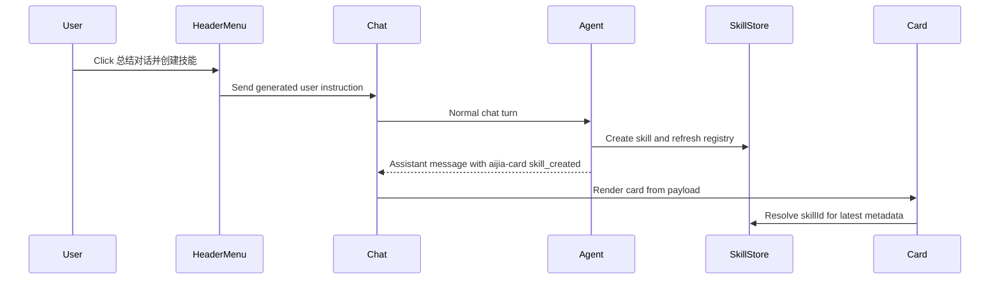
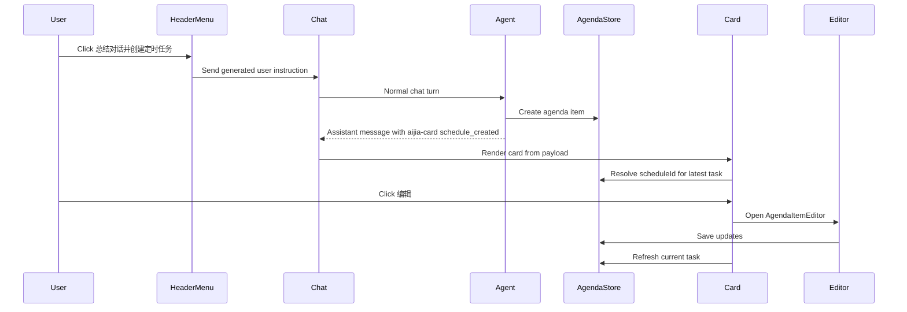

# Conversation More Create Actions Design

## Background

Chat conversations need a richer header action menu. The menu should reuse existing conversation actions and add two creation shortcuts:

- Summarize the current conversation and create a reusable skill.
- Summarize the current conversation and create a scheduled task.

The creation shortcuts should stay conversational: clicking an action sends a clear user message into the current conversation. The agent then performs the creation automatically through existing tools and returns a structured result. There is no separate builder employee, no `skill-smith`, and no new draft surface for the first version.

## Goals

- Add a `more` icon to the chat header and render a dropdown using the existing `AppDropdown` pattern.
- Reuse sidebar conversation actions where they apply: rename, pin or unpin, archive, copy conversation id, and export.
- Add two menu items:
  - `总结对话并创建技能`
  - `总结对话并创建定时任务`
- Make each new item send one explicit message into the current conversation.
- Render successful creation results as polished cards instead of plain markdown.
- Allow scheduled-task cards to open the existing task editor.
- Keep chat history immutable after creation. Editing a scheduled task must update the agenda item, not rewrite `messages.jsonl`.

## Non-Goals

- Do not revive or reference `小程`, `skill-smith`, `skill_smith`, or `/create-skill`.
- Do not add a new side panel or wizard for this first version.
- Do not auto-open a new conversation for creation.
- Do not patch historical assistant messages when a card's referenced task changes.
- Do not make skill-created cards editable in this version.
- Do not implement automatic judgment of whether a scheduled task should first become a skill. That can be a later intelligent routing layer.

## User Experience

### Header More Menu

The chat header right side shows a more icon. Clicking it opens a dropdown with conversation actions and creation actions.

Recommended order:

1. 重命名
2. 置顶 / 取消置顶
3. 导出对话
4. 复制会话 ID
5. 总结对话并创建技能
6. 总结对话并创建定时任务
7. 归档

Destructive or hiding actions should stay visually separated at the bottom if the dropdown component supports grouping; if grouping is not available yet, keep `归档` last.

### Create Skill Flow

When the user clicks `总结对话并创建技能`, the app sends a user message into the current conversation. The message should be explicit and self-contained, for example:

```text
请总结当前对话内容，并把其中可复用的工作流程创建为一个技能。

要求：
1. 从当前对话提炼技能名称、适用场景、输入、执行步骤、输出格式和注意事项。
2. 按当前技能系统规范创建技能并刷新技能列表。
3. 创建成功后，用 aijia-card 返回 skill_created 结果，至少包含 skillId。
```

The visible message can be a concise user-facing version, but the actual sent content should include enough instruction for reliable creation.

After creation succeeds, the assistant returns a structured card block:

````markdown
```aijia-card
{
  "type": "skill_created",
  "skillId": "sales-followup-rules",
  "title": "销售跟进规则",
  "description": "把客户沟通记录整理成下一步跟进计划。"
}
```
````

The card displays the latest skill metadata from the skill store when possible. The markdown payload is a fallback snapshot and a stable reference.

### Create Scheduled Task Flow

When the user clicks `总结对话并创建定时任务`, the app sends a user message into the current conversation:

```text
请总结当前对话内容，并创建一个定时任务。

要求：
1. 把当前对话提炼成定时任务标题、任务提示词、建议频率和开始时间。
2. 使用定时任务能力创建任务。
3. 创建成功后，用 aijia-card 返回 schedule_created 结果，至少包含 scheduleId。
```

The agent should create the scheduled task automatically. It may choose sensible defaults when the conversation does not specify every field, but it should prefer conservative defaults and reflect them in the result card.

After creation succeeds:

````markdown
```aijia-card
{
  "type": "schedule_created",
  "scheduleId": "agenda-123",
  "title": "每日销售跟进提醒",
  "prompt": "每天汇总客户沟通记录并生成跟进计划。",
  "frequencyLabel": "每天 09:00",
  "nextFireAt": "2026-06-13T09:00:00+08:00"
}
```
````

The card opens the existing `AgendaItemEditor` for editing.

## Card Rendering Contract

### Markdown Transport

Assistant messages may include fenced code blocks with language `aijia-card`. These blocks are not rendered as code. They are parsed into product UI cards.

The parser should be forgiving:

- Ignore invalid JSON and render the original code block.
- Ignore unknown card types and render the original code block.
- Support multiple cards in one message.
- Keep surrounding markdown text before and after the card.

### Card Payloads

Skill card:

```ts
type SkillCreatedCardPayload = {
  type: 'skill_created'
  skillId: string
  title?: string
  description?: string
}
```

Schedule card:

```ts
type ScheduleCreatedCardPayload = {
  type: 'schedule_created'
  scheduleId: string
  title?: string
  prompt?: string
  frequencyLabel?: string
  nextFireAt?: string
}
```

Only `type` and the stable id are required. Other fields are snapshots used before the live store data is available.

## Dynamic State Model

Cards should not be the source of truth.

- `skill_created` cards resolve current metadata from the skill store by `skillId`.
- `schedule_created` cards resolve current agenda state by `scheduleId`.
- If live data is unavailable, the card uses the snapshot fields from the markdown payload.
- If the referenced item was deleted, the card shows a clear unavailable state.

This keeps `messages.jsonl` immutable. The message records that a creation event happened; skill and agenda stores record the current state of the created object.

## Editing Behavior

Only scheduled-task cards are editable.

When the user clicks `编辑` on a scheduled-task card:

1. The app loads the agenda item by `scheduleId`.
2. The existing `AgendaItemEditor` opens with the current item.
3. Saving updates the agenda item through existing agenda APIs.
4. The card refreshes from the agenda store.
5. The original assistant message and `messages.jsonl` are not modified.

If the user edits the same task from the scheduled-task page, the card should also reflect the latest state the next time it renders or refreshes.

## Components And Boundaries

### Chat Header

- Extend `ChatTopBar` to accept dropdown menu content or a more-actions prop.
- Use `AppDropdown`; do not hand-roll a new dropdown.
- Keep iconography in `lucide-react`.

### Conversation Actions

Create a small shared builder for conversation action items so the sidebar and header do not drift:

- rename
- pin or unpin
- archive
- copy id
- export

If sharing all actions in the first pass creates too much churn, start by sharing labels and handlers in `ChatPage`, then extract after tests are green.

### Send Creation Message

The menu actions call the existing chat send path for the active conversation. The app should send the generated instruction as a user message, not invoke hidden IPC creation logic.

### Card Parser And Renderer

Add a narrow renderer layer near message rendering:

- Detect `aijia-card` fenced blocks.
- Parse JSON payloads.
- Replace recognized payloads with `AijiaResultCard`.
- Preserve normal markdown behavior elsewhere.

The renderer should be independent of skill or agenda APIs. It receives callbacks or uses small hooks to resolve live data.

### Result Cards

Create two card variants:

- `SkillCreatedCard`
- `ScheduleCreatedCard`

Cards should be compact, dashboard-like, and consistent with existing theme variables. They should avoid large decorative styling. Actions should be clear buttons:

- Skill: `查看技能`, `复制 ID`
- Schedule: `编辑`, `查看定时任务`

## Data Flow

Skill creation:



Scheduled task creation:



## Error Handling

- If the generated send fails, show the existing send failure path.
- If the agent cannot create the skill or task, it should respond normally with the failure reason. No success card should be rendered.
- If an `aijia-card` block has invalid JSON, render it as a normal code block.
- If a referenced skill or schedule cannot be found, show an unavailable card with the id and a muted explanation.
- If schedule editing fails, keep the editor open and show the existing editor error.

## Testing

Frontend tests:

- `ChatTopBar` renders a more button and opens menu items.
- `ChatPage` more action sends the expected generated message for skill creation.
- `ChatPage` more action sends the expected generated message for scheduled-task creation.
- `aijia-card` parser renders normal markdown plus recognized cards.
- Invalid `aijia-card` JSON falls back to code rendering.
- `SkillCreatedCard` resolves metadata by `skillId` and supports fallback snapshot.
- `ScheduleCreatedCard` opens `AgendaItemEditor` and does not mutate message content.
- Editing a schedule updates agenda state and refreshes the card display.

Rust tests are only needed if the agent/tool catalog needs prompt or tool-description changes for producing card blocks. If the first version only changes frontend rendering and generated user instructions, targeted frontend tests are enough.

Intent coverage:

- Add an intent that opens an existing conversation, uses header more to create a scheduled task, observes the result card, edits the task from the card, and verifies the chat message remains present.
- Add an intent that uses header more to create a skill and verifies a skill result card plus skill center visibility.

## Open Questions

1. Should the generated user message be fully visible to the user, or should the UI show a concise label while sending the full instruction?
   - Recommended: show the full instruction in the conversation for transparency, but keep it concise.
2. Should cards support a `createdAt` snapshot?
   - Recommended: optional only. Live stores already carry timestamps.
3. Should the card block be emitted by the agent through prompt guidance or enforced by tool result helpers?
   - Recommended first version: prompt guidance plus frontend parser. Later we can add tool-result helpers if card formatting is unreliable.

## Acceptance Criteria

- The chat header has a more dropdown with inherited conversation actions and the two creation actions.
- Clicking each creation action sends one generated user message into the current conversation.
- A successful skill creation can render as a skill-created card.
- A successful scheduled-task creation can render as a schedule-created card.
- Scheduled-task cards can open the existing editor.
- Editing a scheduled task updates the task store only; the original assistant message and local `messages.jsonl` are not rewritten.
- Non-document code contains no references to retired `小程` or `skill-smith` flows.
